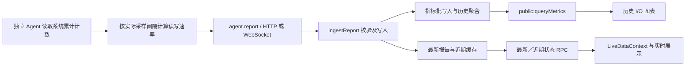

# Agent 改进与磁盘 I/O 监测实施方案

审阅日期：2026-10-01。基准提交：`d694011`。本方案供后续实施 Agent 使用，本次只增加文档，不修改业务代码。

## 1. 审阅结论与当前工程边界

本次重新枚举全仓文件和目录，并重点审阅协议、上报入口、实时缓存、指标存储、查询 RPC、前端数据转换、图表、安装入口和构建配置。当前 Git 跟踪文件共 805 个，审阅开始时工作区干净。未对所有文件进行逐行审计，也未重新运行此前的构建、测试或真实节点联调；下述现状来自本次源码核对，已有执行记录只用作变更背景。

| 目录／入口 | 当前职责 | 与此次改进的关系 |
| --- | --- | --- |
| `cmd/`、`main.go` | 服务启动、命令参数 | 不负责节点硬件采集 |
| `internal/server/` | 启动、配置、生命周期、指标服务 | 注册新增指标、检查升级行为 |
| `protocol/v2/` | Agent JSON-RPC 协议及 Report | 增加可选 I/O 字段 |
| `web/api/client/` | Agent HTTP／WebSocket 上报和统一 ingest | 校验、接收 I/O |
| `web/agent/` | 服务端连接、短期报告、事件队列 | 不是实际探针源码；保存新增实时字段 |
| `database/clients/`、`database/models/` | 节点基础资料、报告校验、兼容响应模型 | 增加字段校验和可空响应 |
| `internal/metricstore/` | 报告映射、批写入、指标定义、历史重构、清理 | 接入读／写速率的持久化链路 |
| `pkg/metric/` | SQLite／MySQL／PostgreSQL 指标与聚合引擎 | 复用现有 Gauge、查询和保留策略 |
| `web/rpc/jsonrpc/` | 实时、近期、历史指标与管理 RPC | 避免新增字段在扁平响应中丢失 |
| `komari-web/src/` | React 页面、状态、图表、固定外观 | 展示实时速率和历史趋势 |
| `scripts/`、根 `package.json` | 统一开发、构建、测试、前端嵌入 | 用现有工程检查入口验收 |
| `.github/`、Dockerfile、install.sh | Linux 服务端构建与发布、安装 | 核对新探针下载来源，不能仅发布服务端 |
| `docs/` | 审阅、实施记录、验证证据 | 老文档中的功能边界需要按当前源码理解 |

当前已移除主题／插件扩展、终端、远程命令、远程文件管理、通知和产品教程。Agent 出站事件白名单目前只有 Ping、启动配置读取和版本切换。此次增加 I/O 应继续沿用 `agent.report`，无需恢复任何远程命令或文件能力。

服务端目前只支持 Linux，不能据此推断独立 Agent 已取消其他平台支持。实际探针源码没有放入本仓库；节点安装代码仍引用 `komari-monitor/komari-agent` 的上游安装脚本。实施时必须取得独立 Agent 源码并固定提交，才能确认其采集库、调度周期、支持平台和发行方式。不能把在 `web/agent` 增加字段当作完成了节点采集。

## 2. 本期目标

必做功能为节点级磁盘读取速率与写入速率，单位 `bytes/s`，覆盖采集、上报、实时显示和历史图表。界面转换成 B/s、KiB/s、MiB/s 等便于阅读的单位。

建议第一期只持久化两条汇总指标，以控制探针开销、网络负载和时间序列数量。IOPS、每块设备详情、利用率、等待时间、累计读写量可以后续增加，不作为本期验收前提。磁盘容量 `disk.used`／`disk.total` 保持原语义，不能用其变化推算 I/O。

本方案默认这里的 I/O 指节点操作系统可见的块设备读写活动。它不等同于文件系统容量变化、应用文件读写字节数或云厂商存储账单；页缓存命中通常不会产生等量的块设备读取。容器内只能看到其权限和命名空间允许访问的统计，不能自动声称获得宿主机完整数据。

## 3. 当前数据链路与必须修改的断点



现有 `DiskReport` 只有 `total` 与 `used`。`ingestReport` 会用服务端接收时间覆盖 `UpdatedAt`，先写入 metricstore，再更新实时缓存。因此速率应由 Agent 使用本机单调时钟计算，不能按服务端接收时间差计算，更不能按浏览器 2 秒刷新周期计算。

新增字段需要穿过多层映射：`common.go` 的最新／近期扁平响应、实例页对近期结果的转换、`LiveDataContext` 的字段映射与相等比较、`RecordHelper` 的实时记录转换、`LoadChart` 的实时指标目录。仅修改 Go 协议或历史指标定义，页面仍可能看不到数据。

## 4. 推荐协议契约

在 `Report` 中增加 `DiskIO *DiskIOReport`，JSON 名为 `disk_io`，允许旧 Agent 完全省略。建议字段如下，正式编码前双方固定同一份契约与样例：

| 字段 | 类型 | 约定 |
| --- | --- | --- |
| `status` | string | `ok`、`warming_up`、`unsupported`、`unavailable`、`disabled` |
| `read_bytes_per_sec` | 可空 float64 | `ok` 时必有，允许真实 0；其余状态为空 |
| `write_bytes_per_sec` | 可空 float64 | 同上 |
| `sample_interval_ms` | int64 | 本次差分对应的实际间隔；`ok` 时必须为正 |

示例为 Report 内部的新增片段，不是完整 JSON-RPC 请求：

```json
{
  "disk_io": {
    "status": "ok",
    "read_bytes_per_sec": 1048576,
    "write_bytes_per_sec": 524288,
    "sample_interval_ms": 2000
  }
}
```

Go 速率字段使用指针保留缺失与真实零的区别，不使用普通 float64 的默认零来表达“未采集”。`warming_up` 等状态省略速率值。公开响应只包含安全状态枚举，不携带原始错误、文件路径、序列号或令牌。

最新与近期 RPC 增加可选 `disk_io` 对象，前端直接消费同一对象，减少二次命名转换。历史通用指标接口使用下节的两个 metric key。旧 `getRecords` 兼容响应如需扩展，应使用可空 `disk_read_rate`／`disk_write_rate`，明确缺失时为空；不得回填升级前的零数据。

## 5. 独立 Agent 的采集与轻量化设计

### 5.1 取得源码后先做一次具体核查

记录 Agent 仓库 URL、提交、Go 版本、实际入口、采集模块、Report 类型、HTTP／WebSocket 发送器、启动参数、测试和发行矩阵。如果已有 gopsutil 的磁盘计数能力，优先复用其已锁定版本；本仓库服务端没有 gopsutil，不能据此给服务端新增该依赖。

若 Agent 尚无相应库，Linux 可直接读取 `/proc/diskstats` 并查询 `/sys/class/block` 拓扑，避免引入重型依赖。依据库或内核格式核实单位；直接解析 Linux diskstats 的 sector 计数时按该接口规定的 512 字节换算，不能套用设备物理扇区大小。无需 shell、iostat 子进程、后台压测或访问用户文件内容。

### 5.2 设备选择必须先解决重复计数

默认统计操作系统可见的整块设备，排除分区、loop 和 ram 设备。不能仅用 `sd*` 正则，要覆盖 virtio、NVMe、device-mapper 和软件 RAID。

对 dm／LVM／md 堆叠设备，默认选择块设备拓扑最上层的整设备，并排除其下层设备，避免一次读写在逻辑层和物理层重复累加。用 sysfs 的 `holders`／`slaves` 和分区标识建立关系；关系不可读取或无法判定时应报告不可用或明确降级，不能静默把所有层相加。这个统计口径是选定逻辑块设备层的活动，并非底层物理介质实际写入量。

提供本地 `auto`／显式设备列表／关闭配置。参数名字待核对 Agent 现有命名风格后确定。显式列表仍验证分区与祖先／后代冲突；冲突配置应明确报错，不能忽略。设备选择结果只在启动及低频拓扑刷新时重建，正常每轮只读取计数。首期不上传设备列表，日志以受限频率说明选择结果。

### 5.3 差分算法与异常行为

1. 每轮一次性读取所有设备计数，保存各设备的 `readBytes`、`writeBytes` 与采样时刻。以设备身份而非数组下标维护状态，Linux 可结合 major/minor 和拓扑变化检测身份变更。
2. 使用两次采样的本机单调时间差：`readRate = Σ(readNow - readPrev) / elapsedSeconds`；写入同理。先做无符号整数差分，再转换浮点数，避免大累计数转换后丢失小增量。
3. 首次采样只建立基线，返回 `warming_up`。成功的第二次采样才返回速率，空闲设备的真实结果为 0。
4. 设备集合变化、计数回退、采集失败后恢复、重启、时间差非正或间隔超过默认采样周期的 5 倍时，重建基线并暂不返回有效汇总；下一次连续正常采样恢复。不要把负差分转为大正数，也不要直接拿重置后的累计值当本轮增量。
5. 默认沿用 Agent 现有监控采样周期，不增加第二套高频循环。I/O 失败只影响这一组指标，CPU、内存、网络和心跳继续上报。
6. 断网时保持采集基线更新，只保留最新报告用于发送；不要无限堆积采样，也不要重连后重放旧速率并以新接收时间入库。核查已有重试机制是否会发送过期报告并修正。
7. 采集状态由单一调度循环维护，或由明确同步保护；不可由每次发送临时重新创建采集器。加入可注入的计数源与时钟，便于测试重启和时间异常。

平台范围建议 Linux 优先完成真实验收；独立 Agent 原有其他平台继续正常编译、运行，暂未实现的平台上报 `unsupported`。如现有库已可靠支持其他平台，可补充平台实现，但必须核实设备层级与单位，不能通过公共接口签名推定行为一致。

## 6. 服务端改动清单

| 文件／模块 | 实施内容 |
| --- | --- |
| `protocol/v2/jsonrpc.go` | 新增可选 DiskIO 类型及契约说明；两端协议保持一致 |
| `database/clients/report.go` | 校验状态、字段组合、非负且有限的速率、有效采样间隔 |
| `web/api/client/ingest.go`、`report_v2.go` | 验证两个传输入口均接入；保留认证 UUID 和服务端接收时间机制 |
| `internal/metricstore/metrics.go` | 增加 `disk.io.read.rate`、`disk.io.write.rate`；纳入清理集合和兼容字段映射 |
| `internal/metricstore/definitions.go` | 定义两项 Gauge，单位 `bytes/s`；遵循现有保留策略初始化规则 |
| `internal/metricstore/report_mapping.go` | 只有 `status=ok` 且两个速率有效时写入两条点；零值也必须写入 |
| `internal/metricstore/report_batcher.go` | 核对队列复制、批写、原始点和聚合都保留新增点，无需新增写入线程 |
| `web/agent/connections.go` | 缓存新字段；避免新增指针对象被后续采集或处理原地修改 |
| `web/rpc/jsonrpc/common.go` | 最新和近期响应带可选 `disk_io`；沿用隐藏节点／权限过滤 |
| `database/models/models.go`、`internal/metricstore/legacy_records.go` | 若保持旧历史查询支持，增加可空字段及重构映射，保持旧数据为空 |
| `web/rpc/jsonrpc/common.record.go` | 兼容查询过滤、扁平化、抽样需保留新字段和缺失语义 |
| `web/rpc/jsonrpc/public.metric.go` | 检查定义列表、通用查询、空点、聚合策略与权限，不必新增独立 I/O RPC |
| `internal/metricstore/deletion.go`、管理指标页面 | 清空系统历史、删节点、关闭保存及保留策略覆盖新增指标 |

速率指标默认用 `avg` 聚合，峰值展示可请求 `max`，不能默认 `sum` 速率或再次应用 counter 的 `rate`。现有 avg 为样本算术平均，图表文案不能把不等间隔样本的 avg 当作严格时间加权平均，也不能用 avg 直接计算累计写入量。

新指标使用现有通用指标结构，无需单独建立磁盘 I/O SQL 表。新增定义必须幂等，启动时不覆盖已有管理员保留配置；复核“保存关闭”的全局／指标级规则，不要在已有禁用保存的环境中意外开启持久化。

新增 I/O 的合法性校验放在既有 ReportVerify 流程，非法协议返回参数错误。采集故障应由 Agent 发送合法的 unavailable 状态，因此不会使正常报告失败。不要将 Agent 的运行故障与恶意／格式错误输入混为一类。

## 7. 前端展示与数据适配

1. `types/LiveData.tsx` 增加 DiskIO 类型；`LiveDataContext.tsx` 接收并验证可选对象，在 `sameLiveRecord` 中比较状态与速率。禁止用 `?? 0` 把未采集转换成空闲。
2. `pages/instance/index.tsx` 的近期结果适配增加 I/O 对象；`utils/RecordHelper.tsx` 的 RecordFormat 和 liveDataToRecords 增加可空速率，缺失点和状态变化不会被模板补零。
3. `pages/instance/LoadChart.tsx` 的指标目录增加两项 key、`bytes/s` 单位和 realtimeValue。复用当前 Recharts、metricSeries、通用查询，不引入新图表库或额外轮询。
4. 节点详情增加“磁盘 I/O”读／写双线图，并提供当前读取、写入速率。新用户默认模板可包含该图；已有用户模板保留布局，在图表选择器提供该图，不强制改写存量配置。
5. 首页卡片与表格可增加紧凑的读／写速率行或可选列；优先保证手机布局，避免挤占容量、CPU 和网络信息。读取／写入颜色与网络上传／下载有所区分，标签说明方向。
6. `ok` 的 0 显示 `0 B/s`；旧 Agent 显示“未支持”；首次采样显示“采样中”；不可用显示“暂不可用”；关闭显示“已关闭”。离线节点隐藏实时速率或明确为历史值，不能看似仍在活动。
7. 历史缺失点为 null，图表保留断点，不连接长时间离线或采集失败区间。复核现有 fill_empty 和 realtime/history 合并逻辑，不能在边界重复插入点或填出假零。
8. 更新五组现有语言的对应文案与单位提示，保留固定外观与已有图表配置能力。

## 8. 安装、升级与可观测性改进

本期先发布能够接受新字段的服务端，再升级独立 Agent，最后确认前端真实展示。新服务端必须兼容旧 Agent；新 Agent 在旧服务端上是否被忽略额外字段，应以对应版本实测为准。保持 JSON-RPC 2.0 与现有方法名，不因新增可选字段更改传输协议版本。

定制 Agent 需要独立构建与发行来源。实施者检查 `NodeFunction.tsx` 的安装脚本 URL、版本切换事件的下载解析及 Agent 自更新来源，确保安装／更新不会退回缺少 I/O 或包含已移除远控能力的上游二进制。先制定来源和版本契约，再更新安装入口；不能仅修改下载字符串而没有可用产物。

建议同时实现小范围采集改进：I/O 错误日志限频、错误恢复日志、采集耗时与设备数量的本地调试信息、关闭配置、退出时停止采样。启动配置读取当前包含凭据，新字段只加入非敏感采集配置，不得把完整启动配置复制到公开节点数据。

不在此次任务中进行全局 Agent 架构重写、通用插件化、全量依赖升级或无依据的删除。清理剩余未用的前端编码依赖属于独立轻量化任务，不与 I/O 验收绑定。

## 9. 分阶段执行与交付物

| 阶段 | 工作与产物 | 进入下一阶段条件 |
| --- | --- | --- |
| P0：基线 | 获取 Agent 源码、固定双方提交；记录现有测试、CPU／RSS、发送体积、采样周期；确定设备统计口径 | 明确真实采集和发行位置 |
| P1：契约／服务端 | 协议、校验、两项指标、实时／近期响应、历史查询；JSON 样例和兼容测试 | 旧报告通过，新报告可读写查询 |
| P2：采集 | 计数读取、拓扑筛选、差分、重置、故障隔离、关闭配置 | 单元测试和 Linux 实测通过 |
| P3：界面 | 当前速率、历史图、类型／转换、国际化、缺失状态、模板兼容 | HTTP／WS 上报都能正确展示 |
| P4：发行与验收 | 修正安装和版本切换来源；完整检查、性能对比、升级／回退记录 | 两仓库产物和证据齐全 |

每阶段使用独立的小提交。交付时分别列出 Agent、服务端、前端的提交及修改文件，附协议样例、设备选择说明、测试日志、界面截图、性能测量和未覆盖平台。不得把模拟数据联调描述为真实探针采集成功。

## 10. 必须覆盖的验证场景

| 类别 | 场景与预期 |
| --- | --- |
| 差分 | 2 秒内读取增加 2 MiB、写入增加 1 MiB，应显示 1 MiB/s、512 KiB/s；改成 4 秒后相应减半 |
| 零与缺失 | 空闲连续采样写入真实零；旧 Agent、首次采样、失败期间不写入假零 |
| 异常 | 计数回退、设备更换、热插拔、进程重启、长时间暂停、时钟墙面调整均无峰值或负速率 |
| 拓扑 | SATA／virtio／NVMe、分区、LVM／dm、md RAID、loop、显式列表冲突有确定结果，无父子重复 |
| 传输 | HTTP、WebSocket、gzip、断网重连；只接收认证节点身份，旧数据不作为新采样重放 |
| 存储 | 两项 Gauge 正确写入、原始／聚合查询一致；保存禁用、保留、删节点、清空历史、备份恢复正确 |
| 前端 | 最新、近期、历史都能显示；移动端、深浅色、五种语言；仅速率变化也会刷新；状态缺失显示正确 |
| 兼容 | 旧 Agent → 新服务端，新 Agent → 对应旧版本服务端，新前端读取旧报告；旧数据库升级无假历史 |
| 退场边界 | 既有 retired 测试仍通过；无 terminal／exec／file 新事件或恢复入口 |

Agent 差分和拓扑测试使用伪计数源／可控时钟，覆盖常规与故障状态。服务端加入实际上报、查询和清理集成测试，不只测试结构体序列化。通用指标存储支持的数据库应复用现有测试矩阵，未实测的驱动明确记录。

本仓库完整检查沿用 `npm run check -- --docker`（在可用 Linux／Docker 工具链中），Agent 执行其自身测试、race 检查和支持平台编译。不要为写方案再次安装工具链或启动生产服务。

真实 Linux 验收在测试机或临时目录进行受控、有限的读写，与 `iostat -dx` 或独立读取 diskstats 对比同一设备、同一统计层与相同时间窗口。考虑缓存、异步刷盘及采样边界影响，应用写入字节数不作为块设备速率的唯一真值。分别验证空闲与负载，不对用户数据执行压测。

性能对比至少记录关闭／开启 I/O 时的 Agent CPU、RSS、采集耗时、报告大小及服务端写入点数，持续观察 10 分钟。首期有效报告只增加两条时间序列点，无每设备历史和额外线程风暴；若开销明显偏离基线，应先定位拓扑扫描频率、JSON 扩张或重试堆积，不能只写“轻量”。

## 11. 可直接交给新 Agent 的任务说明

> 请基于 `docs/Agent改进与磁盘IO监测实施方案.md` 为定制 Komari 增加磁盘读取和写入速率监测。首先读取当前仓库规范并核对最新提交，取得实际独立 Agent 源码、确定其提交和发行来源；`web/agent` 是服务端连接管理代码。第一期实现 Linux 节点级读／写 bytes/s，复用 agent.report 和现有指标引擎，保持字段可选、旧 Agent 兼容、缺失与真实零可区分。正确处理设备拓扑去重、首次采样、计数回退、热插拔、采集失败和重连；实现服务端持久化、实时／近期／历史映射、前端当前值和图表。保留已移除功能的退场边界，完成安装／版本切换来源核对，不进行生产部署或自动更新真实节点。分阶段提交，提供两端协议样例、实测与测试证据、性能对比、兼容和回退说明；实际 Agent 源码未取得时可完成本仓库部分，但必须明确剩余工作，不能宣称全链路完成。
