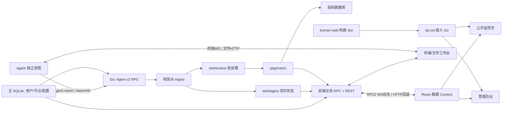

# Komari 前后端完整审阅与轻量化改造报告

审阅日期：2026-10-01。服务端基线：`e8b6bd0`。前端范围：本地 `komari-web` 文件快照；该目录没有独立 Git 元数据，未将父仓库提交号当作前端版本。

本文整合前次服务端梳理与本轮前端审阅，可作为后续逐项保留、删除和重做的决策依据。文中的“建议删除”均为候选方案，本轮未执行功能删减。

## 1. 核心结论

这个项目已经具备三个层面的能力：服务器监控、运维工作台、主题与插件扩展平台。若产品目标是“轻量、美观的探针面板”，最适合先缩减后两类能力，再优化监控本身。

建议首版保留：节点列表、在线状态、CPU/内存/磁盘/网络、有限历史图表、基础管理与认证；按需求保留延迟监测和离线 Webhook。优先评估删除终端/文件编辑/命令执行、插件运行时与市场、多主题市场和在线 SQL 等扩展。

本轮新增的重要结论：

1. 网页源码现已齐全，确认是 React + TypeScript + Vite 单页应用；前台、后台、工作台共用一次构建。
2. 前端真正的实时链路是定时调用 RPC，优先使用 WebSocket 承载，失败时回退 HTTP；服务端旧 /api/clients WebSocket 并非这版前端主链路。
3. 前端能完成类型检查和生产构建。完整 dist 约 9.46 MB，文件编辑器主分块约 3.09 MB，是明确的体积重点。
4. 已有页面懒加载，但 PWA 预缓存覆盖约 8.78 MiB 静态资源，可能在后台下载大量尚未打开的功能资源；首屏执行与后台预缓存必须分开衡量。
5. 后台仪表盘布局、图表全局模板、引导状态复用主题设置接口，删除主题管理不能连同该配置通路直接移除。
6. 服务端现有 CI 会先删除 komari-web 目录再从上游克隆。必须改造构建来源，才能保证本地前端修改进入发行包。
7. Agent 采集程序仍不在当前源码范围内。服务端和前端精简不等于降低每台被监控机器的采集进程开销。

## 2. 审阅范围、方法与验证结果

### 2.1 范围

| 部分 | 已完成的工作 | 尚未覆盖 |
| --- | --- | --- |
| 服务端 | 复用前次全仓 403 文件梳理；复核路由、RPC、实时数据字段、前端承载与构建流程 | 未启动真实服务端，未运行 Go 测试或负载测试 |
| 网页前端 | 扫描 513 个原始文件，解析入口/路由/导入依赖/RPC 字符串，阅读主要功能实现，执行构建和 ESLint | 未对真实服务端做浏览器联调，未完成真实数据下的视觉和交互验收 |
| Agent | 检查服务端协议及前端相关入口 | 未审阅独立采集源码，未测量 Agent CPU/内存 |

前端文件数包含被 .gitignore 忽略、但本地确实存在的 package-lock.json；不包含本轮安装的 node_modules、生成的 dist 和 bundle-analysis.html。行数包含注释和空行，仅用于说明维护规模。

### 2.2 实测检查

| 检查 | 结果 | 含义 |
| --- | --- | --- |
| 安装锁定依赖 | npm ci 成功，使用 --ignore-scripts --no-audit --no-fund | 未运行依赖安装脚本；不是依赖漏洞审计 |
| npm run build | 通过 | tsc -b 与 Vite 生产构建均成功 |
| ESLint | 186 个文件，0 错误、25 警告 | 警告主要涉及 Hook 依赖及 Fast Refresh 导出约定 |
| npm run test:onboarding | 失败 | script/onboarding.test.mjs 缺失，测试未执行 |
| 前端 RPC 名称对照 | 33 个源码字面量方法均在后端 84 个业务 RPC 注册中存在 | 证明名称能对应，不证明参数、返回结构、权限和运行行为完全兼容 |
| 原始前端源文件比对 | 未发现变化 | 本轮没有修改应用源码或配置 |

环境为 Node v24.18.0。Vite 打包阶段日志耗时 34.78 秒，不包含依赖安装、TypeScript 检查及后续所有步骤。当前 PATH 未发现 Go 工具链；服务端需要的 web/public/defaultTheme 嵌入目录尚未准备，因此未报告服务端可运行或测试通过。

明细见 [验证数据 JSON](./前后端审阅验证数据.json)。可交互的构建依赖图见 [bundle-analysis.html](../komari-web/bundle-analysis.html)，该文件由本轮构建生成并被前端 .gitignore 忽略。

## 3. 技术栈与规模

### 3.1 技术栈

以下前端版本来自本地锁文件，不把 package.json 的版本范围当作实际安装版本。

| 层次 | 技术与当前版本 | 主要用途 |
| --- | --- | --- |
| 服务端 | Go；go.mod 声明 1.25.0 | 单进程服务 |
| HTTP/通信 | Gin、Gorilla WebSocket、自建 JSON-RPC | REST、实时查询、Agent 通信 |
| 主数据库 | GORM + SQLite | 账户、节点、设置、任务 |
| 指标存储 | 自建 pkg/metric；SQLite/MySQL/PostgreSQL | 历史监控、聚合、保留策略 |
| 插件 | Goja/goja_nodejs、自建 JS 宿主 | JS 插件及扩展接口 |
| 网页基础 | React 19.1.0、TypeScript 5.8.3、Vite 6.4.2 | 页面开发及打包 |
| 路由 | react-router-dom 7.16.0 | 手写 routes.ts 路由 |
| 界面 | Radix Themes 3.2.1、Radix primitives、Tailwind CSS 4.1.5 | 组件、主题、布局 |
| 图表 | Recharts 2.15.3 | 历史图表、延迟图表、统计卡 |
| 拖拽/动效 | dnd-kit、Motion | 节点排序、图表布局、后台部件 |
| 终端/编辑 | xterm 6.0.0、Monaco 0.56.0、编码识别/转换库 | 多终端、远程文件编辑 |
| 国际化/PWA | i18next、vite-plugin-pwa | 五组语言资源、安装/更新提示、缓存 |

参考：[前端依赖](../komari-web/package.json)、[锁文件](../komari-web/package-lock.json)、[服务端依赖](../go.mod)。

### 3.2 代码规模

服务端前次统计为非测试 Go/JS 约 54,278 行，另有 90 个 Go 测试文件。前端 src 共 194 个文件，其中 TS/TSX/JS/CSS 187 个文件约 46,676 行；五个语言 JSON 总计 395,959 字节。

| 前端模块 | 文件数 | 近似行数 | 说明 |
| --- | ---: | ---: | --- |
| src/pages/admin | 32 | 14,809 | 节点管理、仪表盘、市场、设置等 |
| src/pages/terminal | 26 | 10,077 | 工作台、终端、文件树、编辑器、传输 |
| src/components | 72 | 11,427 | 公共组件、后台组件、引导及基础 UI |
| src/pages/instance | 2 | 2,031 | 节点详情和通用图表编辑面板 |
| src/utils | 18 | 2,768 | 指标序列处理、配置保存、格式化等 |
| src/contexts | 10 | 1,059 | 连接、节点、在线数据、设置等共享状态 |
| src/lib | 4 | 1,050 | RPC 客户端、设置 API、上传等 |

较大的单文件包括节点管理 index.tsx（2,983 行）、FileEditorDialog.tsx（2,018 行）、后台 dashboard.tsx（1,861 行）和 LoadChart.tsx（1,776 行）。这些是后续拆分职责的优先位置；文件行数本身不是性能指标。

## 4. 前后端整体结构

上图的工作台链路表示服务端中继：浏览器不会直接连接 Agent。

### 4.1 服务端职责

| 目录 | 职责 | 精简时的定位 |
| --- | --- | --- |
| cmd、internal/server | 生命周期、引导、初始化和定时任务 | 保留骨架，拆除不需要的初始化和任务 |
| web/api/client、web/agent、protocol/v2 | 上报、连接、在线状态、事件和协议 | 监控核心，优先保持兼容 |
| database | 业务模型和账户/节点/任务操作 | 保留基础模型，逐项收缩附加字段 |
| internal/metricstore、pkg/metric | 指标转换、批处理、聚合、查询、迁移 | 先保留，再依据精度和历史需求简化 |
| web/router、web/rpc/jsonrpc、pkg/rpc | 路由和业务方法、身份与权限 | 删除功能需要同时处理 REST/RPC |
| internal/plugin、pkg/jsruntime | 插件和 JS 执行环境 | 边界明确的主要裁剪候选 |
| web/api/terminal、web/filemanager | 远程工作台 | 与前端工作台配套退场 |
| web/public | 嵌入前端、静态资源、SPA、主题和页面注入 | 必须保留基本承载能力 |
| web/install、migration、recovery、backup、upload | 安装、迁移、恢复、备份和共享上传 | 按数据兼容需求精简，不能按名字整块删除 |

启动链路为 main → cmd.RunServer → 前端解压 → 主库/设置 → 必要的安装/迁移引导 → 指标库 → 后台任务/提供方 → 路由/插件 → HTTP 服务。

主库默认 ./data/komari.db；指标库默认 ./data/metrics.db。前者当前只支持 SQLite，后者支持三种数据库。最新状态、原始样本、写入队列也占用内存，不全在数据库内。

### 4.2 前端职责

| 位置 | 职责 |
| --- | --- |
| src/main.tsx | 根入口、主题、Router、全局 Provider、PWA 与 Toast |
| src/routes.ts | 实际路由清单和页面 React.lazy 导入 |
| src/pages/_layout.tsx | 公开页外壳、实时数据 Provider、导航、背景与页脚 |
| src/pages/Index.tsx | 首页汇总、节点视图和基础信息轮询 |
| src/pages/instance | 节点详情、指标图表、图表模板 |
| src/pages/admin | 后台各业务页面 |
| src/pages/terminal | 独立全屏运维工作台 |
| src/contexts | RPC、公共设置、基础节点、实时状态、管理节点、账户等 |
| src/lib/rpc2.ts | WS/HTTP 调用、心跳、重连、超时、批量请求 |
| src/lib/api.ts、chunkUpload.ts | 设置读写/重启引导、分片上传 |
| src/components | 节点卡片/表格、图表、管理组件、交互基础件 |
| src/components/onboarding | 后台和终端引导；状态通过主题设置保存 |
| src/i18n | 五组语言 JSON；当前静态导入全部语言 |
| src/global.css、contexts/ThemeContext.ts | 全局样式变量、外观及配色 |
| public | 地区旗帜、系统图标、PWA 资源、站点图标 |

虽然 Vite 配置启用了 vite-plugin-pages，实际入口使用手写 routes.ts，未发现对它生成的页面路由模块的消费。页面文件存在不意味着有可访问路由。

## 5. 页面与功能全景

| 页面/路径 | 用户能力 | 后端关联 | 首版候选 |
| --- | --- | --- | --- |
| / | 在线汇总、地区/流量/速率、搜索、分组、卡片/表格 | common:getNodes、getNodesLatestStatus | 保留并简化 |
| /instance/:uuid | 节点详情、实时/历史图表、自定义图表和统计 | recent、public:queryMetrics、指标定义/Ping 统计 | 保留精简版 |
| /admin/login、/admin/account、/admin/sessions | 登录、账户、2FA、会话管理 | 登录/账户/会话 API | 保留基本认证 |
| /admin/servers | 节点添加、安装指引、信息编辑、排序、批量操作 | client CRUD、Token、其他节点操作 | 保留精简版 |
| /admin/dashboard | 综合统计、历史排名、流量、到期、可拖拽部件 | 多指标/Ping 查询、数据库大小、节点修改 | 合并或精简 |
| /admin/ping | 按任务/按服务器组织延迟监测 | Ping CRUD、调度、结果存储 | 按需求保留 |
| /admin/exec | 远程命令、执行结果 | admin:exec 和任务结果 | 可删除 |
| /terminal | 多标签终端、文件管理、编辑器、资源小窗 | terminal WS、file RPC/HTTP、实时 RPC | 优先评估删除 |
| /admin/themes、theme_managed、theme_raw | 主题列表、配置表单/HTML配置页 | 主题 API、共享配置结构 | 固定前端后精简 |
| /admin/market/themes | 主题市场和安装 | 市场源/目录/下载/安装 | 可删除 |
| /admin/plugins、plugins/config、plugin-page | 插件管理、配置与嵌入页面 | 插件 RPC、页面和运行时 | 可删除 |
| /admin/market/plugins、/plugin/:short/* | 插件市场和公开插件页面 | 插件市场/静态文件 | 可删除 |
| /admin/notification/channels、offline、general | 通知通道、离线规则、通知选项 | Webhook/插件通道、notifier | 可保留离线 + Webhook |
| /admin/settings/site、general、custom、sign-on | 站点、通用、定制、认证设置 | Settings、OAuth、GeoIP、备份等 | 合并并缩小配置项 |
| /admin/settings/metrics | 指标定义、保留策略、存储与迁移 | metricstore 配置/迁移 RPC | SQLite-only 后简化 |
| /admin/logs、pprof、about | 审计、性能诊断、版本/项目信息 | 日志、pprof、版本 | 诊断在优化阶段保留 |
| /install、/admin/database-migration、/database-recovery | 安装、迁移、恢复引导 | 独立的受限后端引导服务 | 按部署/兼容范围保留 |
| /manage/* 与旧 settings/theme 等 | 路由兼容跳转 | 无独立核心业务 | 确认旧链接后清理 |

静态导入图未发现 src/pages/admin/client.tsx 与 settings/sso.tsx 从 main/routes 可达；后者的文件存在不代表当前 SSO 功能完全不用，实际认证配置还要检查 sign-on 页面。

旧 components/admin/NodeTable 相关实现也未从当前入口发现运行时导入，当前 /admin/servers 使用 pages/admin/index.tsx。清理这类旧实现能减少维护量，但已被构建排除的代码不会继续贡献同等体积收益。纯类型文件不应按“运行时不可达”删除。

## 6. 数据流、请求频率与接口契约

### 6.1 前端 Provider 与请求

正常页面由 RPC2Provider → PublicInfoProvider → NodeListProvider 包裹；公开页面布局另挂 LiveDataProvider。管理后台使用 AccountProvider 验证登录。安装/迁移/恢复页面跳过常规数据 Provider，走相应引导接口。

| 数据 | 前端位置 | 请求行为 |
| --- | --- | --- |
| 公共站点与主题设置 | PublicInfoContext | GET /api/public，初始化和显式刷新 |
| 节点基础信息 | NodeListContext、Index | common:getNodes；初始化，首页可见时每 5 秒刷新 |
| 最新在线状态 | LiveDataContext | common:getNodesLatestStatus；每次完成后约 2 秒再请求，隐藏页面暂停 |
| 账户 | AccountContext | GET /api/me |
| 管理员节点详情 | NodeDetailsContext | GET /api/admin/client/list |
| 节点近期报告 | instance/index.tsx | GET /api/recent/:uuid，切换节点重新请求并取消旧请求 |
| 历史指标 | LoadChart | public:queryMetrics，按节点、时间范围、指标、聚合方式变化请求 |
| Ping 浮层图 | MiniPingChart | 打开后请求任务、指标、统计；目前不是持续轮询图表 |
| 管理仪表盘 | admin/dashboard.tsx | 挂载/显式刷新批量取数据；不能按首页 2 秒轮询模型估算 |
| 工作台资源小窗 | Terminal/EditorResourceMonitor | 约每 2 秒请求最新状态，隐藏页面时跳过 |

以低延迟、持续可见的首页估算，每分钟约 30 次状态查询 + 12 次节点基础信息查询；另有 RPC 心跳和按交互触发的请求。这是静态频率估算，不是抓包测量。多个浏览器标签页会各自产生流量。

### 6.2 值得优先处理的跨端开销

- LiveDataContext 在详情页仍默认拉全部节点，随后只使用当前节点的一部分数据。后端已支持 uuids 列表筛选；可以按页面订阅范围缩小响应，但需同时照顾详情侧栏在线状态。
- 后端单数 uuid 参数返回单个对象，复数 uuids 参数返回映射；优化时不能只添加参数而不检查前端的 Object.entries 处理。
- common:getNodesLatestStatus 会读取 Ping 任务并附加每节点 Ping 统计，统计有 1 分钟缓存；LiveDataContext 的转换丢弃 ping 字段。可以考虑拆成按需统计，减少不使用的数据计算；不能忽略缓存而宣称每 2 秒都扫描完整历史。
- 首页基础信息变化通常少于运行指标，可以在新增/修改节点后刷新，配合较低频率兜底，减少重复全量节点读取。
- 现有代码已经包含隐藏页暂停、防请求重叠、记录对象复用、memo/useMemo、详情请求取消和路由懒加载；应保留这些行为。

### 6.3 返回结构需要统一

服务端同时提供嵌套的 Agent Report、前端 common:* 扁平状态、兼容 records 和新的 metric series。前端 LiveDataContext、RecordHelper、metricSeries 负责多次转换。未来应为各层定义清楚的类型与字段单位，避免一边删字段一边依赖默认零值掩盖不一致。

已有一个可直接核对的语义差异：服务端 common.go 将 connections 赋为 TCP + UDP，而 LiveDataContext 将这个值放入 connections.tcp，并另外赋值 connections.udp。若保留连接数展示，应统一字段含义并验证下游图表，而不能当成真实 TCP 数量使用。

另外，RPC2Client.call 对 WS 调用的失败统一回退 HTTP；读查询适合此策略，但写操作需要区分连接失败、业务错误和结果丢失，避免不确定情况下重复提交。这是后续接口整理项，本轮未构造故障重放测试。

## 7. 前端构建体积与加载成本

### 7.1 实测产物

总 dist：544 个文件，9,458,266 字节，约 9.46 MB / 9.02 MiB。其中 JavaScript 约 7.48 MB，CSS 约 0.916 MB。以下 kB 采用十进制 1,000 字节。

| 产物 | 原始 kB | 本地 gzip kB | 归属/说明 |
| --- | ---: | ---: | --- |
| FileEditorDialog 分块 | 3,091.44 | 801.55 | Monaco 文件编辑器及相关模块 |
| 全局 index CSS | 774.76 | 96.98 | 根入口样式，包含 Radix Themes 与其他全局样式 |
| 根 entry-index JS | 741.65 | 247.05 | React/路由/全局状态/五组语言等 |
| 工作台 index 分块 | 726.49 | 201.98 | xterm、文件管理、部分编码识别及工作台代码 |
| encoding-indexes 分块 | 530.28 | 187.42 | 文件编码转换映射 |
| metricSeries 分块 | 394.81 | 109.14 | 包含 Recharts 等共享图表依赖，不只是同名工具函数 |
| editor worker | 273.52 | 82.78 | Monaco 后台线程资源 |
| eula 分块 | 200.03 | 64.84 | 共享内容及依赖，名称不等于纯业务文本体积 |

实际模块归属使用构建的 bundle-analysis 确认。单模块 renderedLength 并不是最终压缩后传输大小，所以这里报告实际文件字节，未把 visualizer 的模块统计直接相加当作网络收益。

gzip 列仅是本地逐文件压缩估计，是否采用同样的网络压缩取决于实际部署。以上不是首屏总下载量，也没有测得 LCP、INP 或浏览器内存。

### 7.2 为什么有懒加载仍不够轻

路由和 FileEditorDialog 已经懒加载，所以不能说 3.09 MB 编辑器必然阻塞首页执行。但当前 Workbox 将大量 JS/CSS/SVG 列为预缓存：535 项，日志合计 8,995.11 KiB，约 8.78 MiB。正常页面注册 Service Worker 后，仍可能在后台缓存这些资源。

因此需要分别优化：根入口必须加载的资源、某页面打开时的资源，以及 PWA 后台缓存资源。只保留 lazy、不改变 PWA 或不删除功能，未必能显著降低整体下载和浏览器存储成本。

首页还存在一条静态依赖：Node → MiniPingChartFloat → MiniPingChart → Recharts。图表虽在浮层打开后才渲染，模块已经被静态引用；可将浮层图表本身改为按交互懒加载。实际网络触发时机仍需浏览器验证。

### 7.3 依赖清理重点

| 依赖组 | 与哪些能力绑定 | 建议 |
| --- | --- | --- |
| Monaco、xterm、chardet、text-encoding | 工作台/文件编辑 | 删除工作台后配套移除，优先级高 |
| dnd-kit、Motion | 工作台标签、节点排序、图表布局、后台部件 | 不能随终端一起全部删；先判断其他拖拽和部件是否保留 |
| Recharts | 首页浮层、节点详情、后台图表 | 第一轮保留，缩小导入和查询范围后再评估替换 |
| Radix Themes + primitives + Tailwind | 大多数界面 | 先统一语义变量和组件用法，不宜在第一轮连根替换 |
| 五组静态语言 JSON | 根入口 | 按当前语言加载；或明确仅支持的语言范围 |
| react-toastify、twemoji、uuid、http-proxy-middleware、自引用 komari-web | 未发现对应运行导入，部分名称出现在致谢文本 | 候选清理项，先用依赖/构建检查确认；未进入产物的依赖主要影响安装和维护 |
| @tanstack/react-table | 主要用于旧管理表格实现 | 和旧实现一起核实可达性，不能仅看 package.json 判定首屏成本 |
| next-themes | Toast 包装组件 | 当前根主题来自自定义 ThemeContext，未发现 next-themes ThemeProvider；建议统一主题来源 |

Tailwind 是通过 CSS/构建插件使用的，不能因为没有普通 TS 导入就当作无用依赖。

## 8. 美观与轻量化的界面改造方向

本节基于页面结构和样式代码提出方案，尚未对运行界面做像素级视觉评审，也没有将仓库预览图当作当前运行截图。

现有基础包括响应式布局、卡片/表格双视图、搜索分组、明暗主题、CSS 变量、语义化 km-* 类名和部分键盘交互，可以复用。复杂度主要来自信息项多、同一能力多入口、管理页与工作台扩张，以及可编辑布局带来的配置和组件依赖。

建议以三类页面组织首版：

| 页面 | 第一层信息 | 次级信息 | 可省略项 |
| --- | --- | --- | --- |
| 总览 | 在线数量、节点名称、CPU/内存、网络速率、异常状态 | 地区、分组、磁盘、延迟 | 时钟、大量装饰性汇总、价格/到期、默认展开图表 |
| 节点详情 | 核心指标和固定布局历史图表 | 系统信息、流量累计、按需 Ping | 通用图表编辑器、尺寸拖拽、多种百分位开关 |
| 管理 | 节点、基础设置、账户、保留的通知 | 备份与诊断 | 插件/主题市场、复杂运维工作台、重复概览 |

设计实施建议：统一间距、字号层级、状态色和圆角；为亮/暗模式复用同一语义变量；将错误、离线、无数据、首次安装和加载状态设计完整；小屏先保证节点扫读和单列图表；常驻动画控制在状态反馈所需范围，并保留键盘/焦点和减少动态效果的路径。

颜色不能作为唯一状态提示。图表默认显示常用时间范围与有限曲线，将高级设置隐藏到次级入口或删除。背景图、HTML 注入、多配色和布局编辑不宜都作为首版必需能力。

实现方式建议先保留 React/Vite 与已工作的 API 客户端，收缩页面范围再重做视觉。第一轮同时更换前端框架、协议和指标存储，会使故障来源难以定位；当前构建已通过，没有必须整体推倒重来的证据。

## 9. 前后端功能删减矩阵

P1 表示第一批候选，P2 表示核心运行稳定后处理，P3 表示指标/存储阶段。是否保留仍需由产品范围决定。

| 功能 | 前端位置 | 后端位置 | 建议/阶段 | 注意关联 |
| --- | --- | --- | --- | --- |
| 节点注册/管理 | admin/index、NodeList/DetailsContext | clients、admin.client、autoDiscovery | 保留 | Token、自动注册和安装命令 |
| 实时状态 | LiveDataContext、Node、NodeTable | common.go、ingest、connections | 保留并优化 | 在线状态、字段映射、全部节点查询 |
| 基础历史图表 | instance/LoadChart、metricSeries | public.metric、metricstore、pkg/metric | 保留精简版 | 精度、流量增量、保留策略 |
| 终端/文件编辑 | pages/terminal 全组 | terminal、filemanager、admin.file、Agent file result | P1 候选删除 | 菜单、节点操作、引导、编码库、预缓存 |
| 远程命令 | admin/exec、任务入口 | admin.system/task、database/tasks/tasks.go | P1 候选删除 | Agent exec/result；同目录 Ping 不要误删 |
| 插件平台 | plugins/config/market/plugin_page、动态菜单 | internal/plugin、pkg/jsruntime、plugin API | P1 候选删除 | 请求钩子、上传、页面注入、通知通道 |
| 在线 SQL | 当前未发现独立网页入口 | admin.dbquery.go | P1 候选删除 | 即使页面没有入口，RPC 仍存在 |
| 多主题/主题市场 | themes、theme_*、market/themes | theme API、web/public | P2 改为固定前端 | 图表/后台布局/引导复用主题设置 |
| 可编辑图表和后台布局 | LoadChart、DashboardBoard | 主题设置持久化 | P2 精简为固定布局 | dnd-kit/Motion 引用和布局迁移 |
| 费用/到期/续期 | PriceTags、节点编辑、dashboard | Client 字段、renewal、expire/offline notifier | P2 候选删除 | 搜索、通知、自动顺延逻辑 |
| OAuth/SSO | login、sign-on、账户绑定 | web/oauth、provider、accounts | P2 可只保留密码登录 | 安装/恢复和配置热更新 |
| GeoIP | 地区自动显示、相关设置 | geoip、basicInfo、MMDB接口 | P2 可改手填 | 地区图标/分组仍可保留 |
| Ping | mini charts、LoadChart、admin/ping | tasks/ping、调度、指标查询 | 按需求保留 | 最新状态 RPC 也附带统计 |
| 通知 | channels/offline/general | notifications、messageSender、notifier | 保留离线 + Webhook 候选 | 插件通道删除后默认配置需迁移 |
| GPU/进程/连接数 | DetailsGrid、LoadChart、映射/类型 | protocol、report_mapping、definitions | P3 按实际节点类型收缩 | 真正采集成本需改 Agent |
| 多种指标数据库 | settings/metrics、迁移引导 | pkg/metric 方言、驱动、store migration | P3 可只留 SQLite | 保留单库维护/备份和错误恢复 |
| 老版本迁移 | database_migration | internal/migrations、结构迁移 | P3 有条件缩减 | 新库建表与旧版迁移是不同职责 |
| PWA | 提示组件、manifest、VitePWA | 前端静态承载/引导页处理 | P1/P2 关闭或限制缓存 | 已安装用户的旧 SW 缓存要有退出方案 |
| 账户/2FA/会话 | account、sessions、login | accounts、AuthSensitive、权限模型 | 保留基础认证 | 不以隐藏页面代替鉴权 |
| 备份/恢复/pprof | settings/general、引导、pprof | backup、upload、maintenance、pprof | 优化阶段保留 | 共享上传和诊断能力 |

## 10. 跨模块耦合与已发现问题

### 10.1 不适合直接删除目录的情况

- 删除 REST 路由后，init 注册的 RPC 仍可能调用同一能力；菜单隐藏也不等于功能退场。
- admin.notification.go 中的 reg 是多个管理 RPC 文件共用助手，删文件前先移到公共位置。
- models/theme.go 的配置结构与 internal/managedconfig 被通知/插件/公开设置共用。
- 主题、插件、备份共用分片上传基础设施，删除市场不能直接删除 web/upload。
- 插件加载、HTTP/WS 钩子和 HTML 注入存在于服务入口；清理所有引用后才移除 JS 运行时依赖。
- WriteReport 要求指标库存在，ingestReport 在它成功后才更新实时状态；实时-only 方案需要明确重构该顺序和失败语义。
- 事件队列也服务 Ping 等下发能力，去掉命令/终端不等于事件队列无用。
- web/public 对 /admin 和 /terminal 使用默认前端；只换公开主题不会同步改后台。

### 10.2 本轮应跟踪的具体事项

| 事项 | 证据 | 建议处理时机 |
| --- | --- | --- |
| 本地前端未接入服务端发布 | .github/actions/build-frontend/action.yml 先 rm -rf komari-web 再克隆上游 | 任何正式前端改造之前 |
| 锁文件被前端 .gitignore 忽略，CI 使用 npm install | .gitignore、前端/服务端构建工作流 | 固定构建基线时，确保锁文件受版本管理 |
| 引导测试入口缺失 | package.json test:onboarding 指向不存在文件，命令实测失败 | 声明测试门槛之前 |
| 生成的 PWA 图标路径含字面量占位符 | vite.config.ts 普通字符串写入 ${base}；dist/manifest.webmanifest 复现 | 若保留 PWA，修正并在浏览器验证 |
| PWA manifest 定义重复 | index.html 引用 public/manifest.json，构建又注入 manifest.webmanifest | 与 PWA 范围一并整理 |
| 非根路径部署未统一 | Vite 支持 base，但 BrowserRouter 未配置 basename，多数 API 使用绝对 /api | 若要求子路径部署，统一路由、资源、API与引导路径 |
| TCP/UDP 字段语义不一致 | common.go 的总连接数被 LiveDataContext 放入 tcp 字段 | 核心类型/契约整理阶段 |
| Toast 和页面主题来源不同 | sonner.tsx 使用 next-themes，入口使用自定义 ThemeContext | 视觉统一阶段，验证手动明暗切换 |
| 25 条 lint 警告与宽松 any 规则 | 本轮 ESLint，eslint.config.js | 改动对应模块时逐步处理；不把警告数当作测试覆盖 |
| 备份插件数据目录拼写不一致 | backup_whitelist.go 为 plguin-data，实际为 plugin-data | 若继续保留插件，备份验收前 |

以上代码问题均未在本轮修改。除表中明确列出的命令/构建复现外，潜在运行影响需后续联调验证。

## 11. 构建、部署与前后端整合

当前完整发行链路应理解为：

`komari-web 源码 → npm 构建 → dist + komari-theme.json → dist.tar.zst → web/public/defaultTheme → go:embed → Go 二进制 → Docker/安装脚本`

本轮生成的是 komari-web/dist，尚未自动打包进 web/public/defaultTheme。服务端 Dockerfile 也只复制预编译二进制，不负责完成上述构建。

建议后续将本地 komari-web 作为明确的构建输入：让 CI 使用工作区目录并锁定依赖，输出嵌入归档；如仍要保留“外部前端仓库”模式，应做成明确选项并固定 ref，避免两种来源混用。此项是建议，不在本轮改 CI。

还需统一 Go 工具链：go.mod 要求 1.25.0，现有多个 workflow 的 setup-go 仍写 1.23。SQLite 的 CGO 与跨平台 C 编译链也应纳入可复现构建条件。

源代码中的项目名、安装脚本下载仓库、镜像名、版本检查、文档入口和前端菜单带有原项目引用。完成自有版本时，应建立品牌与更新来源清单逐项调整。本轮没有改名、改远端或发布。

## 12. 推荐目标架构

保持“一个 Go 服务端二进制 + 一个嵌入前端 + SQLite”的部署方式，第一阶段继续沿用 Agent v2 协议。核心链路稳定后，再评估是否用更窄的历史存储替换通用指标引擎。

| 层 | 保留职责 | 期望边界 |
| --- | --- | --- |
| Agent | 基础信息、核心指标、在线心跳；可选 Ping | 通过独立源码审阅决定采集项与上报间隔 |
| 服务端接入 | Token、限界校验、上报、在线状态 | 不与工作台/插件生命周期捆绑 |
| 业务层 | 节点、账户、设置、有限通知 | 前端消费稳定、明确的类型 |
| 指标层 | 必需指标、有限时间窗、可控聚合 | 首先 SQLite-only，保留现有正确性测试 |
| 网页 | 总览、节点详情、精简管理 | 页级懒加载；图表/语言按需加载；少量必要全局状态 |
| 运维 | 安装、必要升级、备份、诊断 | 独立明确的维护路径 |

这里的“SQLite”可以先继续使用主库与指标库两个文件；减少数据库种类不要求第一轮把两个库合并成一个，以免引入写入竞争和迁移工作。

## 13. 实施路线与验收标准

### 阶段 A：固定基线与发布输入

接入本地前端构建、确保锁文件纳入版本管理、统一工具链、准备后端嵌入产物。补齐或纠正现有测试命令。保留本轮体积数据作为前端基线。

验收：从干净工作区能构建包含本地改动的前后端发行包；安装页、登录页、首页可联通真实后端。

### 阶段 B：先删产品外延

分别处理终端/文件管理、远程执行、在线 SQL、插件与 JS 运行时、插件市场。每一类作为可独立回退的改动，并同时处理路由、菜单、RPC、协议分支、配置及后台任务。

验收：核心上报/实时/历史保持工作；已删除功能没有残留入口和直接调用能力；依赖和构建产物反映真实删减。

### 阶段 C：简化页面与配置

固定前端样式与主要图表布局，压缩后台导航；把仍需要的外观/布局设置从多主题管理中分离；决定 PWA、语言、费用、GeoIP、SSO 的保留范围。

验收：桌面与手机的主要任务可完成；明暗主题、键盘、加载/无数据/离线/错误状态一致；未将核心配置保存流程误删。

### 阶段 D：优化请求和存储

统一数据类型、按页面订阅节点、降低基础信息轮询、拆分可选 Ping 统计；限制指标和历史窗口、缩小查询点数。之后再收缩数据库驱动与迁移范围。

验收：相同节点数、上报间隔和访问量下，记录 CPU、RSS、数据库增长、响应时间和实际传输字节；以测量结果继续优化，而不是按代码行数估算节省。

### 阶段 E：Agent 专项

在取得采集源码后检查采样项、采集频率、缓存和上报协议。同步验证断线重连、弱网、节点重启、累计流量重置及版本兼容。

验收：有 Agent 侧真实 CPU/内存/网络对比；服务端或前端缩减不能代替这部分数据。

### 建议记录的统一指标

| 维度 | 指标 | 本轮状态 |
| --- | --- | --- |
| 前端包体积 | 完整 dist、根入口、图表、工作台分块、预缓存 | 已有构建实测 |
| 用户体验 | 首屏请求数/传输量、LCP/INP、页面切换、浏览器内存 | 待真实浏览器测量 |
| 接口成本 | 每分钟请求、响应字节、查询耗时 | 已识别代码频率；待运行测量 |
| 服务端资源 | 空闲/负载 CPU、RSS、Go 堆、数据库增量 | 待后端可运行基线 |
| Agent 资源 | 每台采集 CPU、RSS、上报流量 | 待采集源码与环境 |
| 正确性 | 鉴权、隐藏节点、重连、时间范围、聚合、备份恢复 | 前端构建通过；业务联调待完成 |

## 14. 开工前需要确定的范围

以下选择影响后续删减顺序，当前均未替用户决定：

- 产品是否仅监控，还是保留部分远程管理能力。
- 是否需要 Ping/延迟/丢包和离线通知。
- 是否需要 GPU、进程/连接数、价格/到期字段。
- 历史保留时长、精度，以及是否需要接续既有 Komari 数据。
- 是否仅使用 SQLite；是否保留 PWA、多语言、SSO和多主题。
- 预期节点规模和同时打开面板的人数。

这些范围确认后，可以直接按第 9 节矩阵拆成独立改动，不需要重新从目录开始分析。

## 15. 交付与参考

- 本报告：前后端整合结论、功能与依赖地图、改造顺序。
- [前端文件与接口索引](./前端文件与接口索引.md)：原始文件、实际路由、33 个 RPC 方法及调用位置。
- [审阅验证数据](./前后端审阅验证数据.json)：可复核的体积、版本、检查结果和警告明细。
- [前次服务端报告](./仓库结构与精简分析.md)、[服务端文件索引](./仓库文件索引.md)：保留为服务端详细资料；其中“前端尚未提供”属于前次快照，已由本文更新。

本轮新增文档并生成本地构建产物，没有修改前后端业务代码，没有删除功能、迁移数据库或执行发布。
