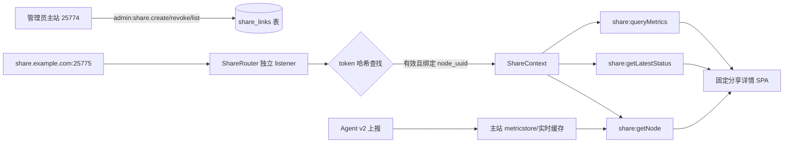

# 临时分享节点页面实施方案

审阅日期：2026-10-02。目标是在现有 Komari 精简版基础上增加“只分享一个节点详情页”的能力。管理员从主站生成链接，访客通过单独的域名和端口访问；访客不能看到节点列表、登录页、管理页、Agent 接口或主站的其他页面。

本方案是后续 Agent 的实施设计，不直接修改业务代码。

## 1. 审阅后的当前状态

最近的开发已把 `komari-agent/` 纳入同一仓库，磁盘 I/O 读写速率已经贯穿 Agent 采集、v2 `agent.report`、服务端 metricstore、实时状态、历史图表和详情卡片。仓库当前包含 927 个 Git 跟踪文件，最近提交集中在 I/O、Agent 安装和前端菜单调整；I/O 的 Go 测试、race、跨平台编译和实机验证仍需在 Linux/CI 完成，不能把这些未完成项混入分享功能的验收结论。

现有运行结构是单进程单 HTTP listener：`cmd/server.go` 从 `KOMARI_LISTEN`／`--listen` 获得主监听地址，`internal/server.App` 在 `Run` 中创建一个 `http.Server`，`web/router.Register` 注册完整 API 和静态 SPA，`web/public.Static` 负责 SPA 回退。Docker Compose 只发布 `25774:25774`。

目前已有的临时分享实现位于站点设置和认证链路：

- `komari-web/src/pages/admin/settings/site.tsx` 生成一个全站 `tempory_share_token`，链接形如主站 `/?temp_key=...`，时长是任意小时数。
- `web/public/public.go` 把 query 参数写入 `temp_key` cookie。
- `web/api/Auth.go`、`web/rpc/jsonrpc/transport.go`、`web/rpc/jsonrpc/dispatch.go` 检查同一个全局 token，并在私有站点模式下放行临时访问。
- `web/rpc/jsonrpc/public.go`、`public.metric.go` 等公共方法仍有多个全站数据入口；只靠前端不显示列表无法阻止访客调用这些接口。

这套机制不能直接扩展：它没有节点 UUID 绑定，没有多条分享记录，`forever` 没有明确语义，也没有独立监听地址。应保留旧字段读取以便迁移和回滚，但新功能不得继续使用旧全站 token。

## 2. 安全目标和边界

### 必须实现

1. 每条分享记录只绑定一个节点 UUID。
2. 分享有效期固定为 `1d`、`1w`、`1mo`、`forever` 四个枚举；服务端计算过期时间，不能信任浏览器时间。
3. 访问入口是独立监听地址，例如主站 `127.0.0.1:25774`、分享站 `0.0.0.0:25775`，再由反向代理把 `share.example.com` 指向 `25775`。
4. 分享端只提供节点详情页及其必要的只读数据；不能列出节点、访问管理 API、登录、OAuth、Agent 上报、Ping 管理、数据库、设置、Pprof 或任何已退场的终端／命令／文件入口。
5. token 使用密码学安全随机值，数据库只保存哈希；链接泄露后可单条撤销，生成新链接不应意外撤销其他链接。
6. 过期、撤销、节点删除、节点隐藏策略变化都必须在服务端立即生效；`forever` 只表示不按时间自动过期，仍可撤销。

### 必须明确的限制

独立域名和新端口不会自动让主站“不可发现”。如果主站端口仍绑定公网地址并允许访问，访客可以扫描或直接访问主站。部署文档必须推荐：主站监听 `127.0.0.1:25774` 或内网地址，分享端口单独由防火墙／反向代理公开；不要把主站端口发布到公网。若主站必须公网监听，至少使用防火墙、VPN、IP allowlist 或反向代理访问控制，应用层无法保证端口不可扫描。

分享 token 是能力凭证，任何得到链接的人都可以查看该节点允许公开的数据。不要把 token 写入访问日志、审计日志、Referer、页面 HTML、localStorage 或 analytics。响应设置 `Cache-Control: no-store`、`Referrer-Policy: no-referrer`，页面请求不加载第三方资源。

## 3. 推荐整体架构

分享 listener 与主站共用已经初始化的数据库、metricstore、Agent 实时缓存和静态资源读取能力，但使用完全独立的 Gin engine 和路由注册函数。不要对同一个完整 engine 增加“根据端口判断权限”的分支；漏注册或中间件顺序错误会造成主站路由泄露。

分享端请求上下文包含 `ShareLinkID`、`NodeUUID`、`ExpiresAt`，RPC 权限检查使用新的 `share` principal。分享端只能调用带有 `share:` 前缀的三个只读方法；禁止复用 `public:*` 的“全站可见”权限，因为 public 方法天然接收任意 UUID 或返回节点数组。

## 4. 数据模型和有效期

建议新增 `database/models/share_link.go`：

| 字段 | 类型 | 说明 |
| --- | --- | --- |
| `ID` | UUID/string | 内部记录 ID，不放入分享 URL 也可以 |
| `TokenHash` | string | SHA-256 或 HMAC-SHA-256 的固定长度十六进制；唯一索引 |
| `NodeUUID` | string | 外键语义绑定 `Client.UUID`，节点删除时级联撤销或查询失效 |
| `Duration` | enum string | `1d`、`1w`、`1mo`、`forever` |
| `ExpiresAt` | nullable time | `forever` 为 NULL；其余由服务端 UTC 计算 |
| `RevokedAt` | nullable time | 撤销时写入，不物理删除历史审计记录 |
| `CreatedAt`、`UpdatedAt` | time | UTC |
| `CreatedBy` | string | 管理员 UUID，审计用 |

分享 URL 建议形如 `https://share.example.com/s/<opaque-token>`，token 至少 32 字节随机值并使用 URL-safe 编码。数据库查询按哈希值等值匹配，响应和日志只显示前后少量掩码字符或内部 ID。不要使用当前 8 位 `Math.random` 前端 token 方案。

有效期计算：

- `1d`：创建时间 + 24 小时。
- `1w`：创建时间 + 7×24 小时。
- `1mo`：按 UTC 日历月增加 1 个月，保留时分秒，日期钳制到目标月最后一天；例如 1 月 31 日对应 2 月最后一天。不要直接依赖 Go AddDate 的溢出归一化结果。API 文案说明是日历月，不是固定 30 天。
- `forever`：`ExpiresAt = NULL`，仍检查 `RevokedAt` 和节点存在。

所有比较在服务端使用 `time.Now().UTC()`。过期记录可由后台任务标记或保留；每次认证仍必须实时判断，不能依赖清理任务。主库迁移必须幂等，现有旧 `tempory_share_token*` 配置不自动变成某个节点分享。

## 5. 主站管理 API 和界面

### RPC

在 `web/rpc/jsonrpc/admin.share.go` 注册管理员方法：

- `admin:createShareLink({uuid, duration})`：验证节点存在，生成 token，写入哈希，返回一次性完整 URL、duration、expires_at 和记录 ID。完整 token 只在创建响应返回一次。
- `admin:listShareLinks({uuid?})`：只返回当前管理员可见的掩码 token、节点名称、duration、expires_at、revoked_at、created_at；不返回哈希。
- `admin:revokeShareLink({id})`：幂等撤销；撤销后旧 URL 立即失效。

复用现有 admin RPC 鉴权、审计日志和错误格式。创建操作应使用事务和唯一哈希约束，避免极低概率的 token 冲突；冲突重新生成。限制单节点和全局活跃分享数量，具体阈值写入配置或常量，防止误操作产生无限链接。

### 管理页面

在 `komari-web/src/pages/admin/settings/site.tsx` 或节点管理页增加“临时分享节点”面板：

- 选择节点下拉框；选择 `1d / 1w / 1mo / forever`；创建后显示一次性完整链接和复制按钮。
- 显示活跃／已撤销／已过期列表，包含节点、有效期、创建时间和撤销按钮；token 只显示掩码。
- 不再生成主站 `/?temp_key` 链接。旧全站分享控件应标为兼容迁移或移除，不能同时显示两个可能误用的机制。
- 复制链接只用 Clipboard API，不把 token 写入 URL 之外的持久化状态；页面刷新后只能看到掩码记录。
- 生成、复制、撤销、过期错误使用五组已有翻译。前端时间只用于展示，不能参与有效期计算。

## 6. 分享 listener、端口和域名配置

新增配置建议：

| 配置 | 默认值 | 说明 |
| --- | --- | --- |
| `KOMARI_LISTEN` | 保留现有 `0.0.0.0:25774` 以兼容升级 | 隐藏主站的推荐部署值为 `127.0.0.1:25774`；使用现有 `--listen` |
| `KOMARI_SHARE_LISTEN` | 空 | 为空则不启动分享 listener；例如 `127.0.0.1:25775` |
| `KOMARI_SHARE_PUBLIC_BASE_URL` | 空 | 生成链接使用的完整 origin，如 `https://share.example.com`，不能从 Host 头盲信推导 |
| `KOMARI_SHARE_TRUSTED_PROXY` | 空/明确配置 | 仅用于受控反向代理场景，不能放宽 token 鉴权 |

配置读取应按职责区分：监听地址放入 `cmd/flags` 和 `App.Options`，固定公开 URL 放入启动配置或专用管理配置；不要在通用 editSettings 中开放任意热切换监听地址。校验端口格式、不能与主站相同、禁止空 host 的意外公网绑定。`KOMARI_SHARE_PUBLIC_BASE_URL` 必须是 `https` 或明确允许的本地开发 `http`，不能包含 query、fragment 或路径；生产生成链接不得使用请求的 `Host`、`X-Forwarded-Host` 或 `Origin`。两个域名的 cookie 不能靠端口隔离，同一 host 的 cookie 跨端口共享，因此正式部署要求分享域名和主站域名不同。

`App` 生命周期增加 `shareEngine`、`shareServer` 和 cleanup：

1. Bootstrap、数据库、metricstore、Agent runtime 初始化完成后构造分享 engine。
2. 主 engine 与分享 engine 分别注册；分享 engine 不调用 `router.Register`。
3. `Run` 同时启动两个 listener，共享一个错误通道；任一 listener 启动失败，按配置决定整个服务启动失败并关闭另一个，禁止“分享端口半启动但 UI 仍生成链接”。
4. `Shutdown` 先关闭两个 HTTP server，再按现有顺序清理 scheduler、metricstore 和数据库。
5. 配置热重载时不要原地替换 listener；端口或 public URL 改动要求显式重启，避免半连接状态。启动日志只输出监听地址，不输出分享 token。

Docker/Compose 增加可选端口映射 `${MONITOR_SHARE_PORT:-25775}:25775`，并把 `KOMARI_SHARE_LISTEN=0.0.0.0:25775` 作为显式启用示例。默认不公开或不开启分享端口。反向代理示例将 `share.example.com` 指向分享端口；主站域名只指向主端口且建议仅内网可达。

“独立域名”应由 DNS 和反向代理提供，应用只生成配置的 public base URL。不能在 Go 服务内伪造 DNS，也不能假设一个端口能同时根据 Host 做真正网络隔离。

## 7. 分享路由与最小数据面

新增 `web/share/` 包，至少拆分为 `server.go`、`auth.go`、`routes.go`、`static.go` 和测试。分享 engine 只允许：

- `GET /s/<token>`：验证 token 后设置短期、host-only、`Secure`、`HttpOnly`、`SameSite=Lax` 的分享 cookie，并 302 到不带 token 的 `/node`；若不想把 token 放入 cookie，也可每次请求使用 Authorization，但前端不能把 token 放入 localStorage。
- `GET /node` 和静态资源：固定分享 SPA。
- `POST /api/share/rpc` 或 `GET/POST /api/share/rpc2`：只接受分享方法，所有请求从 cookie／一次性 token 解析 ShareContext。
- `GET /healthz`：只返回服务状态，不暴露版本、节点或配置。

token 校验成功后 cookie 的 MaxAge 不得超过 `ExpiresAt`，`forever` 使用合理的最长重新认证周期并允许服务端随时撤销；建议会话 cookie 的最长有效期为 24 小时，持有人可再次打开原链接。第一期固定采用 `/s/<token>`，服务器校验后重定向，Gin 和反向代理访问日志都对该路径做脱敏或禁记；Referer 响应头在首次入口就生效。URL fragment 不会发送到服务端，若后续改用 fragment，需要增加浏览器 POST 换票流程，不与本期服务端 GET 路由混用。

建议 cookie 保存另一个随机会话凭证，而非原始分享 token；增加 ShareSession（会话凭证哈希、ShareLinkID、expires_at），每个数据请求关联查询分享记录以检查撤销和到期。换票端点限流并限制每条分享的会话总数；过期会话定期清理。分享端完全忽略 Authorization 中的主站 API key、管理员和 Agent cookie，不调用主站身份识别函数。

分享 RPC 具体返回：

1. `share:getNode`：只返回该 `NodeUUID` 的公开详情。过滤 `Token`、IPv4/IPv6（除非新增明确的分享隐私选项且默认关闭）、内部备注、价格／计费字段、隐藏状态、数据库 ID、Agent 启动配置、管理员信息。
2. `share:getLatestStatus`：服务端忽略请求中的 UUID，始终读取 ShareContext 的节点；返回 CPU、内存、磁盘、网络、连接、GPU、I/O、在线状态和更新时间。
3. `share:queryMetrics`：服务端强制 entity ID 为绑定节点，限制允许的 metric key 为内置安全白名单，限制时间范围、最大点数和查询频率；允许 I/O、CPU、内存、磁盘容量、网络、Ping 等详情页实际使用的指标，不能接受任意 metric 名称或 tags。

`share:getNode` 可作为 bootstrap 一次返回节点资料、安全指标定义、固定图表配置、仅适用于该节点的 Ping 任务标签和 share_expires_at。`share:getLatestStatus` 返回最新状态及首次需要的该节点近期样本；近期区间限定为现有缓存保留窗口。`share:queryMetrics` 返回通用图表数据形状。Ping 标签只含名称与不可逆映射后的本地标识，不返回探测目标、任务 Clients、其他节点 UUID；客户端需要的 Ping 汇总也在这三个方法的明确响应字段提供。数据层先限定节点再查询，不能查询全站后由前端过滤。

分享端不能调用 `public:getNodesInformation`、`public:getPublicSettings`、`public:getClientRecentRecords` 等全站方法。不允许通过 `OnInternalRequest(admin, ...)` 为分享绕过鉴权；提取带必填 nodeUUID 的只读服务函数，两端各自认证后调用。新 share principal 不继承 guest 的 public/common 权限；分享 dispatcher 在注册表调用前显式校验精确方法集合，并拒绝批量请求、未知参数和 entity_ids。所有包含 node/entity UUID 的客户端参数应直接拒绝，不只忽略；绑定信息只取服务端 ShareContext。

默认不允许新建隐藏节点分享；节点隐藏后已有分享立即失效，恢复显示后也要求重新生成链接，避免旧链接意外恢复。隐藏操作同步撤销对应 ShareLink，节点删除同步撤销，会话检查仍验证节点存在。这个规则是本期的确定默认行为，后续若允许管理员分享隐藏节点须单独增加明确选项。

首期显示节点名称、地区、硬件／OS、资源容量及运行指标；名称作为管理员显式分享内容保留。公开备注、tags、分组、价格、计费及流量限制默认不输出，避免任意文本包含主站域名。GPU 标签只保留显示型号，不返回路径。安全指标白名单在代码固定，动态指标定义不能自动加入分享。历史默认最多最近 30 天且受现有保留期限制，每条序列最多 500 点、每次最多 24 个 metric keys、查询 timeout 10 秒；标签只接受经 bootstrap 提供的该节点 Ping/GPU 标识。长时效不会增加数据保留期，forever 也遵守这些查询限制。

静态分享 SPA 必须使用独立入口、独立构建目录及独立资源归档；运行时仅设置 `shareMode` 不足以保证不会提供主站 chunk。不加载 `NavBar`、节点列表、登录跳转、管理员上下文、PWA 安装提示、全局 Footer 链接和分享管理组件。提取 `InstancePage` 中的纯详情展示和图表逻辑，把 `NodeListContext` 替换为单节点数据 provider。构建产物可复用图表和 Radix 组件，但不能只靠 CSS 隐藏主站菜单。

新增 `src/share/main.tsx`、`SharePage.tsx`、`ShareDataProvider.tsx` 和分享 API 客户端，单独 Vite 配置关闭 vite-plugin-pages、PWA、主站 route imports 和 source map。分享 listener 只从专属资源目录服务静态文件，禁止主站 chunk、manifest、service worker、source map 和任意 SPA 回退。扩展 `scripts/project.mjs`、`scripts/embed-frontend.mjs`、Go embed、Docker 和前端 artifact CI，使两个归档都参与构建和一致性验证。

当前 `LoadChart.tsx` 直接使用 Account、PublicInfo、NodeList、LiveData、RPC2 上下文，并请求全站 Ping 任务和指标定义；不能原样导入后寄希望于分享 cookie 限权。先提取显式接收 node、latest、recent、definitions、pingTasks 和查询函数的图表组件，主站与分享分别提供适配器。分享模式禁止保存全局模板，只使用安全固定模板和本地展示交互。`DetailsGrid` 的 ioOnline 改为显式输入，保持 I/O 在线、缺失和零语义。

## 8. 权限和中间件顺序

分享 engine 的中间件顺序建议为：请求 ID与限流 → 脱敏日志 → 安全响应头 → CORS（默认不允许跨域）→ 分享认证 → 只读 RPC 权限 → handler。不要挂载 `api.IdentityMiddleware` 的管理员 session 逻辑，也不要让主站 session cookie 在分享域名下可用；分享 cookie 使用独立名称和 host-only 属性。

只对数据路由应用分享认证；固定错误页、受限静态资源和不带信息的健康检查有明确例外，不允许认证失败时回退主站 HTML。Host allowlist 使用配置的分享 origin，反代仅信任明确代理，伪造 Host/X-Forwarded-Host 不能重定向或暴露主站。分享端点采用相对 URL、同源 Origin 检查、有限 body 大小，并且不启用宽泛 CORS。Cookie 生产名称可用 `__Host-monitor_share`（Secure、Path=/、无 Domain），本地 HTTP 使用明确的开发名称。

分享 HTML 不经过 `web/public.Static` 的主站 title/CustomHead/CustomBody 注入，也不使用站点 favicon、footer HTML、自定义背景 URL、脚本域名或 OAuth 配置。固定本地资源，CSP 至少限制 connect-src/script-src 到自身、禁止 frame 和 object；包含必要的 Radix inline style 例外时记录原因。HTML/API/错误响应均 no-store、no-referrer、X-Robots-Tag noindex，robots.txt 可禁止索引但不作为权限保护。错误不得回显 DSN、主站监听地址或重定向至主站。主站地址没有被客户端请求或响应返回是可验证目标；同 IP、DNS 历史或公开证书可能形成关联，无法承诺完全不可推断。

撤销或过期对下一次服务端请求生效，既已下载的数据无法收回。前端用服务端 expires_at 计时，过期立即清空数据、停止轮询；撤销时最多在下一个 5 秒轮询发现，错误时清空图表而非保留离线缓存。浏览器从后台恢复、页面刷新和重新打开都先重新认证；分享 API 不使用主站 Service Worker。无网络时显示不可获取，不展示过期缓存。

分享认证失败统一返回 `404` 或无差别 `410`，不要区分 token 不存在、已撤销、已过期和节点不存在，避免枚举有效链接。有效但不在线返回节点详情和“离线”状态；不应退化为主站登录页面。所有分享 API 使用 POST body 或已认证 cookie，不接受可猜的 UUID 查询参数。

限流至少按 token 哈希、客户端 IP 和全局分享端口三个维度；查询历史和静态资源分别限制。分享端禁止 WebSocket 到主站，实时状态可采用 5 秒轮询；若复用 RPC2 WebSocket，必须新增分享专用 WS handler 和相同的 ShareContext 校验，不能把主站 `/api/clients` 暴露出来。

## 9. 旧分享机制迁移

1. 新版本启动保留读取旧 `tempory_share_token` 配置的能力，但不在分享 listener 接受它。
2. 主站设置页删除或显著标记旧全站分享入口；升级时把旧 token 置为撤销／失效，避免同一链接继续放行主站。
3. 不自动猜测旧 token 对应节点，不自动生成分享记录；管理员重新选择节点并生成新链接。
4. `web/api/Auth.go`、`web/rpc/jsonrpc/transport.go`、`dispatch.go` 和 `public.go` 的旧放行逻辑应在迁移完成后删除，或严格限制为兼容退场窗口并有明确截止版本。
5. 旧字段可保留在配置表以便数据库回滚，但备份恢复后也不能重新打开主站全站访问；恢复测试应明确验证旧 token 无效。

## 10. 测试与验收

### 服务端单元与集成

- `1d/1w/1mo/forever` 计算、UTC、月末、过期边界和重启后持久化。
- token 哈希匹配、随机冲突重试、掩码、创建一次性返回、撤销幂等。
- 一个 token 只能读取绑定 UUID；篡改 UUID、请求其他节点、缺失节点、隐藏节点变化均失败或只返回绑定节点。
- 旧 `temp_key` 不能访问分享端；分享 cookie 不能访问主站；主站管理员 session 不能在分享端获得 admin 权限。
- 分享 RPC 白名单、metric key／时间范围／点数限制、限流、CORS、响应头和日志脱敏。
- 主端口和分享端口同时启动、任一端口冲突回滚、关闭时两个 listener 都释放；分享端口为空时不监听。
- 节点删除、token 撤销、数据库恢复、配置热重载后的行为。

### 前端与浏览器

- 分享 URL 只显示固定节点详情，刷新、复制链接、打开新标签仍有效至过期；URL 中 token 经过一次跳转后不再显示。
- 不请求 `/api/nodes`、`/api/admin/*`、`/api/clients`、登录/OAuth、主站公共全站 RPC；网络面板只能看到 share API。
- 旧 Agent、离线节点、I/O 未支持、I/O 真实零和历史空洞显示正确；详情图表不出现节点选择器。
- 桌面、移动、深浅色、五种现有语言和响应式布局；无第三方字体、图片或脚本请求。

### 部署验收

- 主站只监听 loopback／内网，分享端口单独映射；反向代理的两个域名分别指向对应端口。
- 从分享域名访问主站路径、主站域名访问分享路径、直接访问主端口和分享端口的未知路径均得到预期的 404/拒绝。
- 外部扫描只能发现分享端口时，分享端不会返回版本、路由清单或节点列表；不能把“端口未被扫描到”写成应用测试结论。
- 在 Linux/Docker 中运行现有 `npm run check -- --docker`，并增加分享前端构建、Go 单测、race、浏览器 E2E 和反向代理 smoke test。Windows 当前没有 Go 工具链，不能将本机通过的前端检查代替服务端验证。

## 11. 分阶段交付

### 具体修改位置

| 文件／模块 | 工作 |
| --- | --- |
| `database/models/share_link.go`、新增 share session 模型 | 凭证哈希、节点绑定、时间、撤销与会话 |
| `database/dbcore/dbcore.go`、`internal/migrations/` | 新模型建表、旧全站分享停用、幂等迁移与恢复检查 |
| 新 `internal/sharing/` | 创建／换票／鉴权／撤销，安全 DTO 和固定节点只读查询 |
| `web/rpc/jsonrpc/admin.share.go` | 主站 create/list/revoke，沿用 admin 权限与审计 |
| `web/share/`、`pkg/rpc/`（按需） | 独立 dispatcher、路由、凭证认证、静态资源、限流和响应头 |
| `cmd/server.go`、`cmd/flags/config.go`、`internal/server/app.go`、`runtime.go` | 参数与双 listener 的启动、失败回收、关闭 |
| `web/api/Auth.go`、`web/rpc/jsonrpc/transport.go`、`dispatch.go`、`public.go`、`pkg/rpc/meta.go` | 退场旧 TempShareValid 放行；删除前搜索完整依赖 |
| `web/public/public.go`、`komari-web/src/main.tsx` | 删除旧 query/cookie 换票；主站静态逻辑不用于分享站 |
| `komari-web/src/share/`、独立 Vite 配置 | 仅详情入口、单节点 provider、安全 API 客户端 |
| `pages/instance/index.tsx`、`LoadChart.tsx`、`components/DetailsGrid.tsx` | 提取纯展示与数据适配，保持原主站详情行为 |
| `pages/admin/settings/site.tsx` 或节点管理组件、五组语言 | 创建／复制／撤销界面，退场旧控件 |
| `scripts/project.mjs`、`embed-frontend.mjs`、`.github/actions/`、`Dockerfile` | 两份独立前端归档与构建、嵌入一致性验证 |
| `compose.yaml`、`install.sh`、README | 可选分享端口、loopback 主站映射、反代和更新不覆盖旧配置 |

分享功能关闭时主站原有功能与监听行为保持兼容。部署示例在同宿主机反代下可将 Compose 主站端口映射为 `127.0.0.1:25774:25774`，分享映射为 `127.0.0.1:25775:25775` 后由分享域名代理；如果反代也运行在 Docker 网络中，可完全不发布这两个内部端口，只让反代连接对应容器端口。保持 Agent 到主上报地址可达，不能为了收紧网页访问顺带阻断现有节点。

自动安装不设置 DNS、不修改防火墙、不强行切换主站绑定地址；新增 opt-in 分享配置和文档即可。用户本次授权范围为方案，后续实际部署和网络变更应在明确目标机器与域名后执行。分享记录/会话备份恢复会使恢复时仍有效的旧凭证重新出现，包括已在备份之后撤销的凭证；建议恢复后默认撤销全部分享，管理员重新生成，不能假设备份天然保存最新撤销状态。

| 阶段 | 交付物 | 退出条件 |
| --- | --- | --- |
| P0 基线 | 记录当前旧分享行为、端口、部署拓扑；冻结 I/O 当前协议和前端详情依赖 | 明确主／分享域名、监听地址、反代和隐私字段 |
| P1 数据与管理 | ShareLink 模型、迁移、admin create/list/revoke、审计和设置 UI | 四种时效及单节点绑定测试通过 |
| P2 独立 listener | ShareRouter、独立端口、配置、生命周期、Docker/反代示例 | 主端口路由不会出现在分享 engine |
| P3 最小分享 API | share principal、认证 cookie、三个只读 RPC、限流和脱敏 | 越权 UUID、全站 RPC、旧 token 均失败 |
| P4 分享前端 | 独立节点详情入口、实时/历史/I/O、移动端和多语言 | 浏览器网络检查只有分享资源和 API |
| P5 迁移与发布 | 关闭旧全站 token、完整检查、升级/回滚/部署文档 | 端口隔离和失效行为在 Linux/Docker 实测通过 |

## 12. 可直接交给新 Agent 的任务说明

> 请基于 `docs/临时分享节点页面实施方案.md` 实现临时分享节点页面。先读取当前仓库规范和最近提交，确认磁盘 I/O 已接入且不要恢复已移除的终端、命令、文件、通知或插件功能。新增持久化 ShareLink 记录，每条记录绑定一个节点和 `1d/1w/1mo/forever` 时效，token 只保存哈希并支持单条撤销。新增独立分享 listener 和独立配置端口；主站与分享站分别注册 Gin engine，分享 engine 只提供固定分享 SPA、健康检查和绑定节点的只读 RPC。分享页面只能展示一个节点详情、实时状态、历史指标和 I/O，不得请求节点列表、管理员接口、登录、Agent 上报或其他全站方法。服务端必须强制绑定 UUID、限制指标白名单、时间范围和点数，防止通过篡改请求越权。配置主站监听、分享监听和固定 public base URL；Docker/反向代理文档必须说明主站应只绑定 loopback/内网，换端口本身不是隐身保证。迁移并关闭旧全站 `tempory_share_token` 放行逻辑，完成 token 脱敏、限流、安全响应头、缓存策略、端口冲突、关闭和节点删除测试。提交协议样例、单元/集成/E2E/部署验证证据；未在 Linux/Go/Docker 实测的内容必须明确标注，不能宣称已完成。
