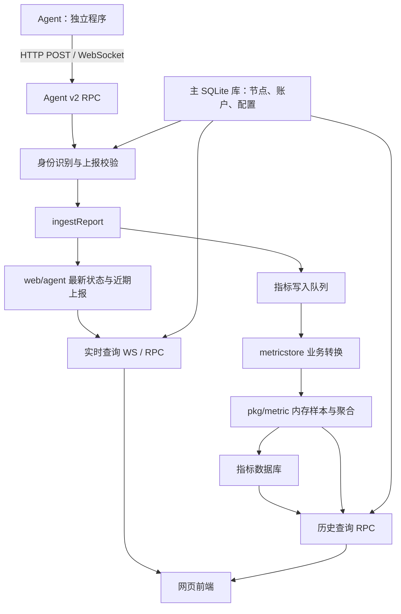

# 仓库结构与轻量化改造分析

> 更新：用户已补充 komari-web 源码。包含前端审阅与构建实测的整合结论见 [Komari 前后端完整审阅报告](./Komari前后端完整审阅报告.md)。本文保留为前次服务端快照。

分析日期：2026-10-01。源码基线：`e8b6bd0`。范围：当前本地仓库，不代表上游最新版本。

## 1. 结论与仓库边界

当前项目是 Komari 的 Go 服务端。它既负责监控数据接收与展示接口，也包含远程管理、主题、插件、多种指标数据库等扩展能力。若目标是精简的服务器状态面板，可以保留监控主链路，分阶段移除附加能力。

三个部分需要分开考虑：

| 部分 | 当前仓库情况 | 对改造的影响 |
| --- | --- | --- |
| 服务端 | 包含完整 Go 源码 | 可在本仓库删减接口、运行时、存储和后台任务 |
| 网页前端 | 不包含前端项目源码；CI 从 komari-monitor/komari-web 拉取、构建并嵌入 | 美化页面、裁剪管理页面，需要接入前端源码或制作新的前端 |
| 采集端 Agent | 不包含采集程序源码；web/agent 是服务端连接和事件管理代码 | 降低被监控机器上的采集开销，需要另外分析 Agent 源码 |

前端来源依据：[构建工作流](../.github/actions/build-frontend/action.yml)、[前端构建说明](../web/public/readme.md)。尚未分析独立前端及 Agent 仓库，不能据此判断前端框架、组件体积或 Agent 实际开销。

本轮只新增分析文档，没有修改业务代码、删减功能或下载其他仓库。

## 2. 全仓规模

以分析开始时 git ls-files 为准，共 403 个跟踪文件，其中 361 个 Go 文件、12 个 JavaScript 文件、90 个 Go 测试文件。Go/JS 非测试源码约 5.43 万行，测试约 2.02 万行，包含注释和空行。

JavaScript 文件主要服务于嵌入式 JS 运行时，并非网页前端。

| 模块 | 非测试 Go/JS 文件 | 近似物理行数 | 测试文件 |
| --- | ---: | ---: | ---: |
| web | 81 | 16,223 | 26 |
| pkg/jsruntime | 52 | 11,184 | 7 |
| pkg/metric | 28 | 10,056 | 19 |
| internal/plugin | 15 | 3,685 | 8 |
| internal/metricstore | 17 | 2,807 | 4 |
| utils | 24 | 2,547 | 8 |
| database | 24 | 2,366 | 6 |
| internal/migrations | 4 | 1,428 | 3 |

插件与 JS 运行时合计约 1.49 万行，适合作为减少维护范围的重点。代码行数不能换算为二进制缩减比例或内存节省比例；运行资源收益需实际测量。

全部文件按目录收录于 [仓库文件索引](./仓库文件索引.md)，并附静态 RPC 注册清单。

## 3. 目录职责

| 目录或文件 | 实际职责 | 阅读入口 |
| --- | --- | --- |
| main.go | 设置日志、输出版本、调用命令行入口 | [main.go](../main.go) |
| cmd | Cobra 命令，启动服务、重置密码、关闭 2FA、恢复密码登录 | [server.go](../cmd/server.go) |
| cmd/flags | 监听地址、主数据库路径与类型 | [config.go](../cmd/flags/config.go) |
| internal/server | 启动、安装引导、存储初始化、路由、后台任务和退出清理 | [runtime.go](../internal/server/runtime.go) |
| internal/config | 数据库配置项、默认值、订阅配置变化 | [settings.go](../internal/config/settings.go) |
| internal/managedconfig | 解析可管理配置中的节点、延迟任务等选择器 | [selectors.go](../internal/managedconfig/selectors.go) |
| internal/metricstore | 将业务上报映射为指标，批处理、历史兼容查询、迁移与维护 | [report_batcher.go](../internal/metricstore/report_batcher.go) |
| internal/migrations | 旧配置、时间戳、节点、延迟任务和历史监控数据迁移 | [migrations.go](../internal/migrations/migrations.go) |
| internal/plugin | 插件安装、启停、JS 宿主、HTTP/WS 钩子、页面注入、通知扩展 | [plugin.go](../internal/plugin/plugin.go) |
| internal/notifications | 注册内置 Webhook 通知通道 | [notifications.go](../internal/notifications/notifications.go) |
| internal/scheduler | 定时调度器，服务于 Ping、清理、指标聚合、通知、插件 | [scheduler.go](../internal/scheduler/scheduler.go) |
| internal/sqlitetune | SQLite 连接参数与运行配置 | [connector.go](../internal/sqlitetune/connector.go) |
| internal/lifecycle | 请求重启的进程内信号 | [restart.go](../internal/lifecycle/restart.go) |
| database/models | 节点、用户、会话、任务、通知及主题/插件配置的数据结构 | [models.go](../database/models/models.go) |
| database/dbcore | 主库初始化、连接、升级备份、空间维护 | [dbcore.go](../database/dbcore/dbcore.go) |
| database/accounts、clients | 用户认证/会话与节点 CRUD、上报校验 | [report.go](../database/clients/report.go) |
| database/tasks、records | 远程任务、Ping 配置；历史记录的兼容查询入口 | [records.go](../database/records/records.go) |
| database/auditlog | 审计记录与过期清理 | [log.go](../database/auditlog/log.go) |
| pkg/metric | 底层时序存储、SQL 方言、聚合、降采样、分位数和保留策略 | [store.go](../pkg/metric/store.go) |
| pkg/jsruntime | Goja JS 引擎及 Node 风格的文件、网络、进程等模块 | [README.md](../pkg/jsruntime/README.md) |
| pkg/rpc | JSON-RPC 类型、注册表、调用、身份及权限模型 | [principal.go](../pkg/rpc/principal.go) |
| pkg/timeutil | 系统时区下的日期比较等辅助函数 | [timeutil.go](../pkg/timeutil/timeutil.go) |
| protocol/v2 | Agent 通信消息和网络测试数据结构 | [jsonrpc.go](../protocol/v2/jsonrpc.go) |
| web/router | 对外 HTTP/WS 路由的主要装配点 | [router.go](../web/router/router.go) |
| web/api | 身份识别、私有站点限制、WebSocket 和特殊 HTTP 处理 | [Auth.go](../web/api/Auth.go) |
| web/api/client | 自动注册、Agent HTTP/WS 上报、基础信息、在线状态 | [ingest.go](../web/api/client/ingest.go) |
| web/api/admin、public | 登录/OAuth、主题与插件市场、备份、2FA、上传等 HTTP 接口 | [archive_upload.go](../web/api/admin/archive_upload.go) |
| web/rpc/jsonrpc | 面向前端的业务 RPC、REST 桥接、分发及权限校验 | [dispatch.go](../web/rpc/jsonrpc/dispatch.go) |
| web/agent | 服务端保存 Agent 连接、最近上报、事件队列与启动配置请求 | [connections.go](../web/agent/connections.go) |
| web/api/terminal | 浏览器与 Agent 之间的终端会话与转发 | [request.go](../web/api/terminal/request.go) |
| web/filemanager | 远程文件 RPC 配对、文件上传下载、中继、预览令牌 | [transfer.go](../web/filemanager/transfer.go) |
| web/connection | WebSocket 并发安全包装及可选插件拦截器 | [safe_conn.go](../web/connection/safe_conn.go) |
| web/oauth | GitHub、QQ、通用 OAuth 提供方及注册工厂 | [oauth.go](../web/oauth/oauth.go) |
| web/public | 嵌入前端、解压缓存、主题选择、SPA 回退、自定义 HTML | [public.go](../web/public/public.go) |
| web/install、migration、recovery | 首次安装、数据迁移、指标库故障恢复的受限服务 | [guides.go](../internal/server/guides.go) |
| web/upload、backup | 共享分片上传及备份恢复校验 | [handler.go](../web/upload/handler.go) |
| web/security | CORS 和 WebSocket Origin 相关规则 | [cors.go](../web/security/cors.go) |
| utils/geoip | IP 地区查询、MMDB 数据库和缓存 | [geoip.go](../utils/geoip/geoip.go) |
| utils/notifier、messageSender | 上下线、流量、到期通知及通道注册/发送 | [sender.go](../utils/messageSender/sender.go) |
| utils/renewal | 节点到期时间的自动顺延 | [renewal.go](../utils/renewal/renewal.go) |
| utils/log、item 及其他 | 日志、配置标签解析、随机令牌、版本、Ping 调度等 | [pingSchedule.go](../utils/pingSchedule.go) |
| .github | 前端构建、二进制/Docker 发布、快照、开发部署等自动化 | [build.yml](../.github/workflows/build.yml) |
| Dockerfile、install-komari.sh | 打包已编译二进制；Linux/systemd 安装管理 | [Dockerfile](../Dockerfile) |

## 4. 运行与数据流

### 启动顺序

`main → cmd.Execute → RunServer`，随后按顺序执行：

1. 解压嵌入的默认前端到 ./cache/dist。
2. Bootstrap 创建数据目录、连接主库、读取设置。
3. 必要时进入首次安装或数据库迁移引导。
4. 连接指标库；失败时可进入受限恢复界面。
5. 启动上报批处理器，初始化 OAuth、GeoIP、通知。
6. 注册定时任务、构建路由、加载插件。
7. 启动 HTTP 服务；退出时停止 HTTP，再逆序清理已登记资源。

主要入口：[cmd/server.go](../cmd/server.go)、[internal/server](../internal/server)。

### 监控主链路

关键接口与调用链：

| 用途 | 入口 | 主要实现 |
| --- | --- | --- |
| 节点自动注册 | POST /api/clients/register | web/api/client/autoDiscovery.go |
| Agent 上报/事件拉取 | GET/POST /api/clients/v2/rpc | report_v2.go → ingest.go |
| 在线列表和最新数据 | WS /api/clients，浏览器发送 get 或 get UUID | web/api/ws.go → web/agent/connections.go |
| 节点基础信息 | GET /api/nodes | public:getNodesInformation |
| 历史指标 | /api/rpc2 调用 public:queryMetrics；兼容 /api/records/load | public.metric.go、public.go |
| 近期原始报告 | GET /api/recent/:uuid | public:getClientRecentRecords |
| 管理员接口 | /api/admin 下 REST 与 /api/rpc2 下 admin:* | router.go、admin.*.go |

/api/clients 使用浏览器消息触发返回数据，不能仅凭 WebSocket 名称假设服务端会主动持续广播。

Agent v2 RPC 与前端 RPC 是不同入口和分发机制：前者在 handleV2RPC 中处理 agent.report 等方法；后者使用 public:/common:/admin: 命名空间与 pkg/rpc 注册表。

### 两套数据库

| 存储 | 默认位置 | 保存内容 |
| --- | --- | --- |
| 主库：GORM + SQLite | ./data/komari.db | 节点、用户、会话、设置、Ping 任务、命令任务、通知配置、审计日志等 |
| 指标库：pkg/metric | ./data/metrics.db | 监控历史与 Ping 指标；支持 SQLite、MySQL、PostgreSQL |
| 运行内存 | 无磁盘路径 | 在线连接、最新/近期报告、精确指标样本、写入队列和聚合状态 |
| 文件目录 | ./data/theme、plugin、plugin-data 等 | 主题、插件代码与插件持久数据 |

主库当前只支持 SQLite；go.mod 中的 MySQL/PostgreSQL 依赖属于指标存储能力，不能将二者混为一谈。

旧 records、gpu_records、ping_records 等结构仍用于迁移或兼容返回，但常规历史读写已转到 metricstore，不能仅看模型名称决定删除。

### 影响资源的实际参数

- 上报批处理间隔为 3 秒，报告与 Ping 队列各有 512 个槽位，见 report_batcher.go。
- web/agent 保存最新报告，以及最近 1 分钟的报告列表。
- pkg/metric 的精确样本固定在内存保留 10 分钟，超过 1 分钟后无损编码；这些精确样本本身不落盘。
- 聚合层级为 1 分钟、5 分钟、1 小时、1 天，并按指标保留策略裁剪。内置指标初始 RetentionDays 为 1，不能把终端层的较大上限理解成默认长期保留。
- SQLite 指标写连接固定为 1，并配置 2 个只读连接；不要仅依据配置结构里的通用连接池默认值估算 SQLite 的连接数。
- 定时任务包含每 30 分钟清理、每 5 分钟指标聚合、每小时历史保留清理、每分钟流量通知、每日到期检查，以及各 Ping 任务。

依据：[批处理](../internal/metricstore/report_batcher.go)、[实时缓存](../web/agent/connections.go)、[原始样本](../pkg/metric/raw_points.go)、[保留定义](../internal/metricstore/definitions.go)、[存储配置](../internal/metricstore/config.go)、[后台任务](../internal/server/runtime.go)。

## 5. 功能删减地图

以下是候选建议，尚未决定或实施删除。难度表示涉及的耦合范围，不是运行资源占用排名。

| 功能 | 建议 | 主要位置 | 删减时的关联点 | 难度 |
| --- | --- | --- | --- | --- |
| 节点注册、Token、基本信息、在线状态 | 核心保留 | database/clients、web/api/client、web/agent | 管理页、鉴权和上报协议 | 高 |
| CPU/内存/磁盘/网络实时数据 | 核心保留 | protocol/v2、ingest.go、connections.go | 指标映射、前端字段契约 | 高 |
| 历史图表 | 保留精简版本，后期优化 | internal/metricstore、pkg/metric、public.metric.go | 流量增量、Ping、迁移、查询与保留策略 | 高 |
| 账户、会话、权限、来源检查 | 保留基础能力 | accounts、Auth.go、pkg/rpc、web/security | 几乎全部管理接口 | 高 |
| 插件及插件市场 | 优先评估删除 | internal/plugin、pkg/jsruntime、admin.plugin.go、plugin_market.go | 启动、HTTP/WS 钩子、页面注入、上传、插件通知通道 | 中高 |
| 网页终端 | 纯监控产品可删除 | web/api/terminal | 浏览器/Agent 两侧路由、事件派发、敏感验证 | 中 |
| 远程文件管理 | 纯监控产品可删除 | web/filemanager、admin.file.go | 文件结果上报、传输路由、预览令牌、清理任务 | 中 |
| 远程命令执行 | 纯监控产品可删除 | admin.system.go、admin.task.go、database/tasks/tasks.go | agent.exec/taskResult、任务结果清理；保留同目录 Ping 能力时不能整目录删除 | 中 |
| 在线 SQL 查询/执行 | 优先评估删除 | admin.dbquery.go | RPC 直接注册，无需单独 REST 路由 | 低 |
| Agent 启动配置读取/版本切换 | 可删除 | admin.agent.go、web/agent/startup_config.go、switch_version.go | 协议事件及结果回传 | 中 |
| 主题市场与多主题管理 | 使用固定前端时可删除 | admin/theme*.go、web/public | 默认前端承载、站点设置、共享配置结构仍需保留或替换 | 中 |
| OAuth/SSO | 可只保留密码登录 | web/oauth、admin.provider.go、database/oauth.go | 启动、配置热更新、安装/恢复向导、账户绑定 | 中 |
| GeoIP 自动识别 | 可改为手填地区 | utils/geoip、uploadBasicInfo.go | 启动、热更新、MMDB 更新/测试入口 | 低中 |
| 费用、到期、自动续期 | 可删除 | Client 字段、utils/renewal、notifier/expire.go | 上线通知也会触发续期，需同步拆分 | 中 |
| GPU、进程数、TCP/UDP 连接数 | 按需求精简 | protocol/v2、metricstore 映射/定义、查询层 | 不改 Agent 采集配置或实现，就不能保证降低采集成本 | 中 |
| Ping/延迟/丢包 | 建议按产品定位决定 | database/tasks/ping.go、utils/pingSchedule.go、protocol/v2、metricstore/ping_records.go | 调度、事件队列、图表、节点详情统计 | 中高 |
| 通知 | 可仅保留离线 + Webhook | notifier、messageSender、internal/notifications | 上下线状态、登录、流量、到期与插件通道 | 中 |
| MySQL/PostgreSQL 指标存储 | 单机部署可只留 SQLite | pkg/metric/store.go、dialect*.go、metricstore/config.go | 驱动、方言、连接测试、迁移 UI/RPC | 中高 |
| 旧版数据迁移 | 仅在明确全新安装时考虑缩减 | internal/migrations、web/migration | 新库建表与 schema 升级不等同于旧版兼容，不能一起删 | 高 |
| 备份恢复 | 建议保留简化流程 | web/backup、admin/download.go、web/install | 共用分片上传和首次安装路径 | 中 |
| pprof 性能诊断 | 优化阶段建议保留 | web/api/admin/pprof.go | 后续量化内存/CPU收益有用 | 低 |

## 6. 删除前必须知道的耦合

1. **删除 REST 路由不等于删除功能。** 很多操作在 init 中注册 RPC，仍能经 /api/rpc2 调用。裁剪需覆盖 UI、REST、RPC、Agent 消息处理和后台任务。
2. **通知文件放着公共注册助手。** admin.notification.go 中的 reg 被大量 admin.*.go 调用；删通知文件前要先把该助手移到 register.go 等公共位置。
3. **主题数据结构被其他能力复用。** models/theme.go 和 internal/managedconfig 同时参与通知、插件和公开设置；不能因删除主题就整个移除。
4. **分片上传是共享基础设施。** archive_upload.go 将备份、主题、插件接到同一上传服务。删除市场与插件后，保留备份仍可能需要 web/upload。
5. **插件贯穿请求入口。** 除插件页面和市场，还需处理 runtime.go 的加载/关闭、HTTP 包装与 HTML 注入，以及 connection 的 WebSocket 拦截器。当前非测试源码对 pkg/jsruntime 的直接引用都来自 internal/plugin；解开插件引用后才适合清理 JS 引擎依赖。
6. **历史存储当前是强依赖。** WriteReport 在 GetStore 为空时返回错误，ingestReport 随后才更新实时状态。因此实现“只保留实时监控”必须改写上报链路，不能仅关掉数据库初始化。
7. **上报成功不代表同步落盘。** 正常运行时 WriteReport 先入队返回；精确样本与持久化聚合也有不同生命周期。改写时需明确重启后的历史数据要求。
8. **事件队列同时服务多个功能。** 删除终端、文件与命令后，如仍保留 Ping 或其他下发能力，web/agent/v2_events.go 仍有用途。
9. **前台主题与后台默认页面不同。** web/public/public.go 对 /admin、/terminal 强制使用默认主题。只换前台主题不会自动重做管理后台。
10. **设置开关不代表编译裁剪。** 只隐藏页面或关闭插件，通常不会移除已链接的依赖。反过来，代码很多也不代表空闲时就占用很多 CPU，收益需测量。

## 7. 当前构建与验证条件

- go.mod 声明 Go 1.25.0；多个工作流 setup-go 写的是 1.23。二次开发时应统一工具链声明，不能仅凭工作流值断言当前项目支持 Go 1.23。
- SQLite 使用 mattn/go-sqlite3；主要跨平台发布工作流启用 CGO 并使用 Zig 作为 C 交叉编译工具。
- web/public/public.go 通过 go:embed 引用 defaultTheme/komari-theme.json 和 defaultTheme/dist.tar.zst；本地目前缺少整个 defaultTheme 目录。完整构建前必须准备真实前端产物。
- Dockerfile 仅把预编译二进制装入 Alpine 镜像，本身不是从源码编译的多阶段 Dockerfile。
- 本轮检查当前 PATH，未发现 go、gcc、zig 命令；未安装工具链、未运行程序或 Go 测试，没有实测 CPU、内存、包体积和数据库增长。
- 仓库包含 90 个 Go 测试文件，但当前 .github 文本扫描未发现 go test 调用；存在测试不代表发布流程已执行测试。
- 仓库带有 LICENSE（文本标注 MIT）与 NOTICE，二次开发交接时应一并纳入文件清单。

静态梳理发现的后续核对事项：web/rpc/jsonrpc/README.md 仍有“插件待实现”等落后于当前源码的描述；备份白名单中的 plguin-data/ 与实际插件目录 plugin-data/ 拼写不一致。这里记录观察，不在本轮修改。

## 8. 建议的改造顺序

### 第一阶段：确定产品范围并建立可运行基线

建议首版定位：节点列表、CPU/内存/磁盘/网络、在线状态、简洁历史图表、基础后台；按需求保留延迟监测和离线通知。

先接入前端源码或新前端，补齐嵌入产物与工具链。固定节点数、上报间隔、指标数量和页面查询频率，记录基线：二进制体积、空闲/活跃内存、CPU、每天数据库增长、首屏资源量。

### 第二阶段：裁剪边界相对清晰的扩展

按独立变更处理远程 SQL、终端、文件管理、命令任务、Agent 版本控制；再按依赖范围拆插件系统与 JS 运行时、市场、多主题和不需要的提供方。不要在同一轮同时改协议和重写存储。

每删除一项，同时核对 REST/RPC 注册、协议处理、定时任务、配置字段、持久化模型和前端入口。优先复用现有相关测试；新的测试只覆盖真正发生变化的行为。

### 第三阶段：精简持久化和指标

先限制为 SQLite，明确保留哪些指标、保留多久、图表所需精度，再决定是否替换通用时序存储。多层聚合本身也用于减少历史数据量，不能简单认为去掉聚合就会更轻。

若仅全新部署，可单独评估旧版迁移兼容；若需要接续已有 Komari 数据，先保留迁移和恢复链路。

### 第四阶段：重做前端体验

以节点概览、节点详情、精简管理三个层次组织页面，减少首屏图表和附加面板。前端只读取保留的功能契约，按需加载历史数据和图表。新前端可继续嵌入现有 Go 二进制，具体框架选择待前端源码分析后决定。

### 后续每项删减的验收范围

- 核心链路：注册、鉴权、上报、断线重连、实时查询、历史查询。
- 功能退场：旧 REST 与直连 RPC 均不再暴露已删除能力。
- 数据边界：节点删除、历史过期清理、保留的备份恢复及数据升级。
- 对应测试：protocol/v2、web/api/client、web/agent、pkg/rpc、web/rpc/jsonrpc、metricstore 和被改动模块的现有测试。
- 资源指标：在同一负载下对比基线，以实测决定下一轮裁剪。

本轮完成的是架构与删减依赖梳理，并未批准或执行表中任何删减方案。
